# Secret Network MCP Server - Architecture Document

**Version**: 1.0  
**Date**: November 2, 2025  
**Author**: Architecture Team  

---

## Table of Contents

1. [Executive Summary](#executive-summary)
2. [System Overview](#system-overview)
3. [Architecture Diagrams](#architecture-diagrams)
4. [Component Design](#component-design)
5. [Data Flow](#data-flow)
6. [Security Architecture](#security-architecture)
7. [Performance & Scalability](#performance--scalability)
8. [Deployment Architecture](#deployment-architecture)
9. [API Design](#api-design)
10. [Error Handling & Recovery](#error-handling--recovery)
11. [Monitoring & Observability](#monitoring--observability)
12. [Future Considerations](#future-considerations)

---

## Executive Summary

The Secret Network MCP Server is a Model Context Protocol (MCP) server that provides Claude AI with comprehensive access to the Secret Network blockchain. It enables secure wallet management, token operations, staking, governance participation, smart contract interactions, and IBC transfers through a clean, intuitive interface.

### Key Features

- **70+ MCP Tools** covering all blockchain operations
- **End-to-End Encryption** for sensitive operations
- **Multi-Wallet Management** with secure key storage
- **Smart Contract Support** with automatic encryption/decryption
- **Real-time Blockchain Queries** with intelligent caching
- **Transaction Safety** with validation and confirmation flows
- **IBC Support** for cross-chain operations

### Technology Stack

- **Language**: Python 3.7+
- **SDK**: secret-sdk-python 1.8.2
- **Protocol**: MCP (Model Context Protocol)
- **Blockchain**: Secret Network (Cosmos SDK based)
- **Architecture**: Layered, modular design

---

## System Overview

### High-Level Architecture

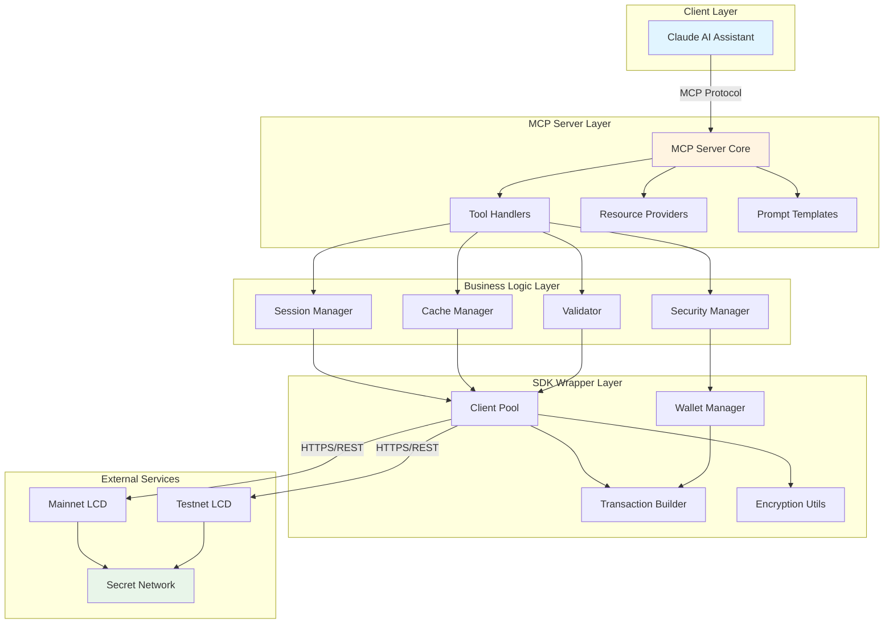
```mermaid
graph TB
    subgraph "Client Layer"
        Claude[Claude AI Assistant]
    end
    
    subgraph "MCP Server Layer"
        MCP[MCP Server Core]
        Tools[Tool Handlers]
        Resources[Resource Providers]
        Prompts[Prompt Templates]
    end
    
    subgraph "Business Logic Layer"
        Session[Session Manager]
        Security[Security Manager]
        Cache[Cache Manager]
        Validation[Validator]
    end
    
    subgraph "SDK Wrapper Layer"
        ClientPool[Client Pool]
        WalletMgr[Wallet Manager]
        TxBuilder[Transaction Builder]
        Encryption[Encryption Utils]
    end
    
    subgraph "External Services"
        SecretNet[Secret Network]
        Mainnet[Mainnet LCD]
        Testnet[Testnet LCD]
    end
    
    Claude -->|MCP Protocol| MCP
    MCP --> Tools
    MCP --> Resources
    MCP --> Prompts
    
    Tools --> Session
    Tools --> Security
    Tools --> Cache
    Tools --> Validation
    
    Session --> ClientPool
    Security --> WalletMgr
    Cache --> ClientPool
    Validation --> ClientPool
    
    ClientPool --> TxBuilder
    ClientPool --> Encryption
    WalletMgr --> TxBuilder
    
    ClientPool -->|HTTPS/REST| Mainnet
    ClientPool -->|HTTPS/REST| Testnet
    Mainnet --> SecretNet
    Testnet --> SecretNet
    
    style Claude fill:#e1f5ff
    style MCP fill:#fff4e1
    style SecretNet fill:#e8f5e9
```

### Component Interaction Overview

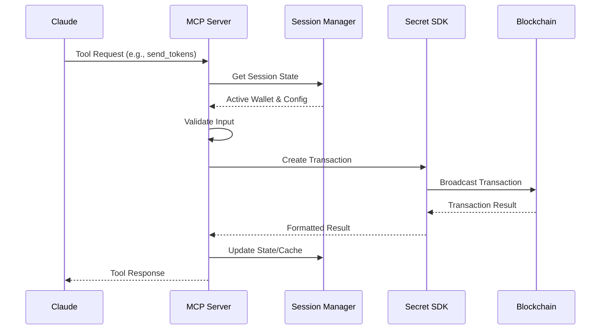
```mermaid
sequenceDiagram
    participant C as Claude
    participant M as MCP Server
    participant S as Session Manager
    participant SDK as Secret SDK
    participant B as Blockchain
    
    C->>M: Tool Request (e.g., send_tokens)
    M->>S: Get Session State
    S-->>M: Active Wallet & Config
    M->>M: Validate Input
    M->>SDK: Create Transaction
    SDK->>B: Broadcast Transaction
    B-->>SDK: Transaction Result
    SDK-->>M: Formatted Result
    M->>S: Update State/Cache
    M-->>C: Tool Response
```

---

## Architecture Diagrams

### 1. System Context Diagram

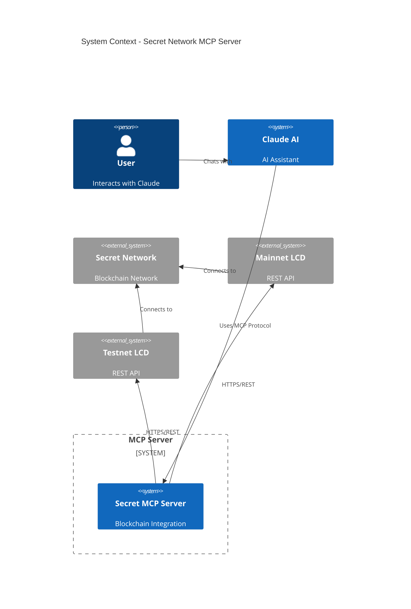
```mermaid
C4Context
    title System Context - Secret Network MCP Server
    
    Person(user, "User", "Interacts with Claude")
    System(claude, "Claude AI", "AI Assistant")
    System_Boundary(mcp, "MCP Server") {
        System(server, "Secret MCP Server", "Blockchain Integration")
    }
    System_Ext(secret, "Secret Network", "Blockchain Network")
    System_Ext(lcd_main, "Mainnet LCD", "REST API")
    System_Ext(lcd_test, "Testnet LCD", "REST API")
    
    Rel(user, claude, "Chats with")
    Rel(claude, server, "Uses MCP Protocol")
    Rel(server, lcd_main, "HTTPS/REST")
    Rel(server, lcd_test, "HTTPS/REST")
    Rel(lcd_main, secret, "Connects to")
    Rel(lcd_test, secret, "Connects to")
```

### 2. Container Diagram

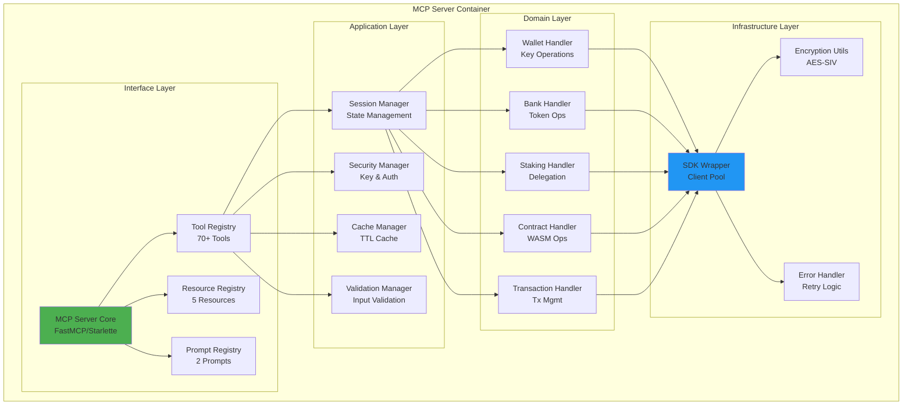
```mermaid
graph TB
    subgraph "MCP Server Container"
        subgraph "Interface Layer"
            MCPCore[MCP Server Core<br/>FastMCP/Starlette]
            ToolRegistry[Tool Registry<br/>70+ Tools]
            ResourceRegistry[Resource Registry<br/>5 Resources]
            PromptRegistry[Prompt Registry<br/>2 Prompts]
        end
        
        subgraph "Application Layer"
            SessionMgr[Session Manager<br/>State Management]
            SecurityMgr[Security Manager<br/>Key & Auth]
            CacheMgr[Cache Manager<br/>TTL Cache]
            ValidationMgr[Validation Manager<br/>Input Validation]
        end
        
        subgraph "Domain Layer"
            WalletHandler[Wallet Handler<br/>Key Operations]
            BankHandler[Bank Handler<br/>Token Ops]
            StakingHandler[Staking Handler<br/>Delegation]
            ContractHandler[Contract Handler<br/>WASM Ops]
            TxHandler[Transaction Handler<br/>Tx Mgmt]
        end
        
        subgraph "Infrastructure Layer"
            SDKWrapper[SDK Wrapper<br/>Client Pool]
            EncryptionUtil[Encryption Utils<br/>AES-SIV]
            ErrorHandler[Error Handler<br/>Retry Logic]
        end
    end
    
    MCPCore --> ToolRegistry
    MCPCore --> ResourceRegistry
    MCPCore --> PromptRegistry
    
    ToolRegistry --> SessionMgr
    ToolRegistry --> SecurityMgr
    ToolRegistry --> CacheMgr
    ToolRegistry --> ValidationMgr
    
    SessionMgr --> WalletHandler
    SessionMgr --> BankHandler
    SessionMgr --> StakingHandler
    SessionMgr --> ContractHandler
    SessionMgr --> TxHandler
    
    WalletHandler --> SDKWrapper
    BankHandler --> SDKWrapper
    StakingHandler --> SDKWrapper
    ContractHandler --> SDKWrapper
    TxHandler --> SDKWrapper
    
    SDKWrapper --> EncryptionUtil
    SDKWrapper --> ErrorHandler
    
    style MCPCore fill:#4CAF50
    style SDKWrapper fill:#2196F3
```

### 3. Layered Architecture

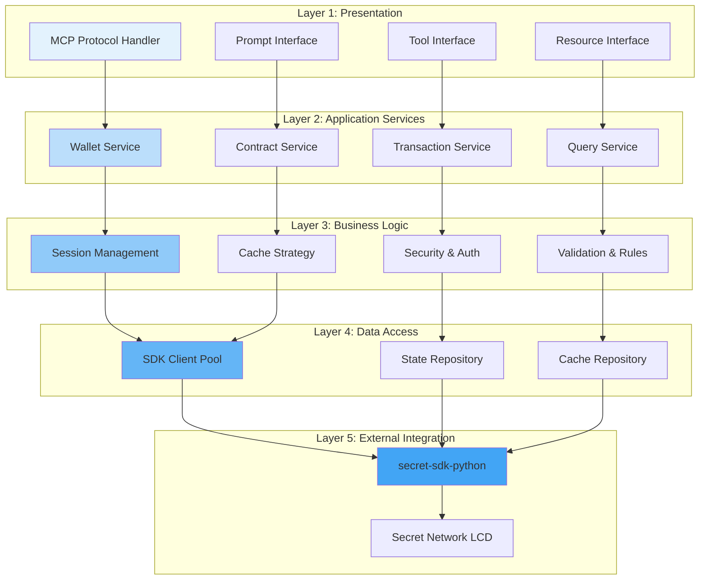
```mermaid
graph TB
    subgraph "Layer 1: Presentation"
        L1A[MCP Protocol Handler]
        L1B[Tool Interface]
        L1C[Resource Interface]
        L1D[Prompt Interface]
    end
    
    subgraph "Layer 2: Application Services"
        L2A[Wallet Service]
        L2B[Transaction Service]
        L2C[Query Service]
        L2D[Contract Service]
    end
    
    subgraph "Layer 3: Business Logic"
        L3A[Session Management]
        L3B[Security & Auth]
        L3C[Validation & Rules]
        L3D[Cache Strategy]
    end
    
    subgraph "Layer 4: Data Access"
        L4A[SDK Client Pool]
        L4B[State Repository]
        L4C[Cache Repository]
    end
    
    subgraph "Layer 5: External Integration"
        L5A[secret-sdk-python]
        L5B[Secret Network LCD]
    end
    
    L1A --> L2A
    L1B --> L2B
    L1C --> L2C
    L1D --> L2D
    
    L2A --> L3A
    L2B --> L3B
    L2C --> L3C
    L2D --> L3D
    
    L3A --> L4A
    L3B --> L4B
    L3C --> L4C
    L3D --> L4A
    
    L4A --> L5A
    L4B --> L5A
    L4C --> L5A
    
    L5A --> L5B
    
    style L1A fill:#E3F2FD
    style L2A fill:#BBDEFB
    style L3A fill:#90CAF9
    style L4A fill:#64B5F6
    style L5A fill:#42A5F5
```

---

## Component Design

### Tool Handler Architecture

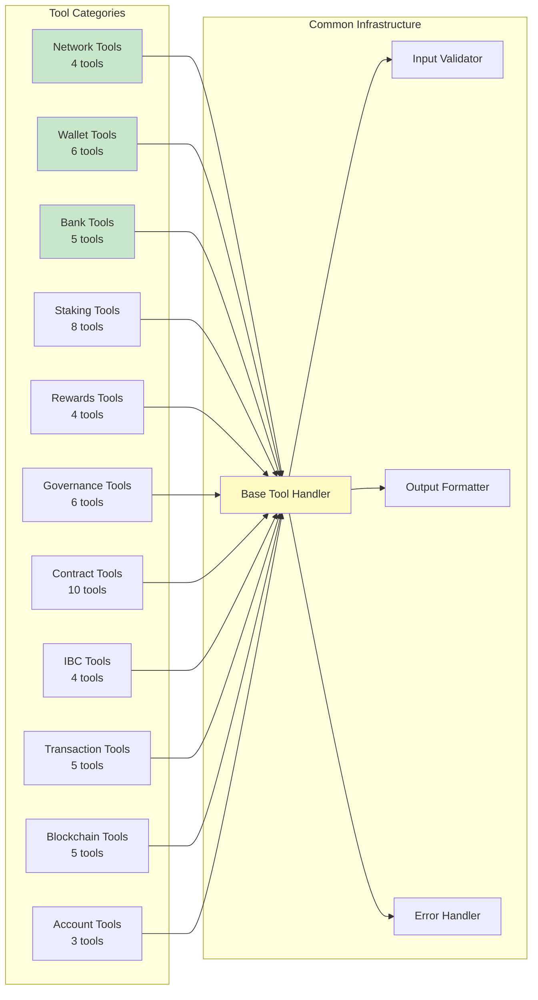
```mermaid
graph LR
    subgraph "Tool Categories"
        Network[Network Tools<br/>4 tools]
        Wallet[Wallet Tools<br/>6 tools]
        Bank[Bank Tools<br/>5 tools]
        Staking[Staking Tools<br/>8 tools]
        Rewards[Rewards Tools<br/>4 tools]
        Gov[Governance Tools<br/>6 tools]
        Contract[Contract Tools<br/>10 tools]
        IBC[IBC Tools<br/>4 tools]
        Tx[Transaction Tools<br/>5 tools]
        Block[Blockchain Tools<br/>5 tools]
        Account[Account Tools<br/>3 tools]
    end
    
    subgraph "Common Infrastructure"
        Base[Base Tool Handler]
        Validation[Input Validator]
        Format[Output Formatter]
        Error[Error Handler]
    end
    
    Network --> Base
    Wallet --> Base
    Bank --> Base
    Staking --> Base
    Rewards --> Base
    Gov --> Base
    Contract --> Base
    IBC --> Base
    Tx --> Base
    Block --> Base
    Account --> Base
    
    Base --> Validation
    Base --> Format
    Base --> Error
    
    style Base fill:#FFF9C4
    style Network fill:#C8E6C9
    style Wallet fill:#C8E6C9
    style Bank fill:#C8E6C9
```

### Session Management Architecture

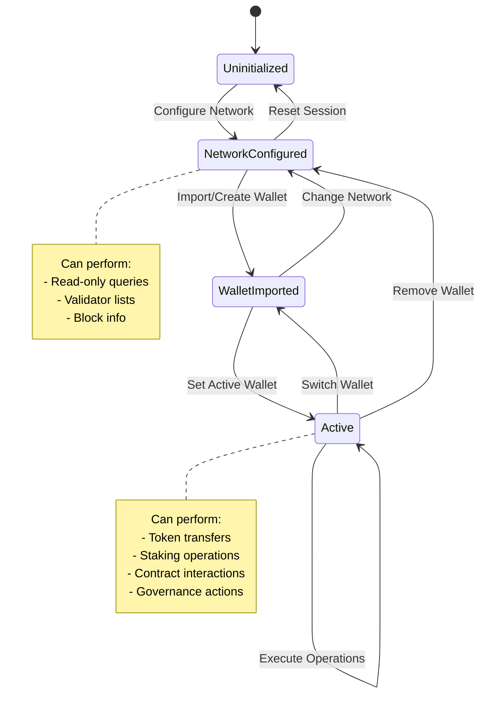
```mermaid
stateDiagram-v2
    [*] --> Uninitialized
    Uninitialized --> NetworkConfigured: Configure Network
    NetworkConfigured --> WalletImported: Import/Create Wallet
    WalletImported --> Active: Set Active Wallet
    Active --> Active: Execute Operations
    Active --> WalletImported: Switch Wallet
    Active --> NetworkConfigured: Remove Wallet
    NetworkConfigured --> Uninitialized: Reset Session
    WalletImported --> NetworkConfigured: Change Network
    
    note right of Active
        Can perform:
        - Token transfers
        - Staking operations
        - Contract interactions
        - Governance actions
    end note
    
    note right of NetworkConfigured
        Can perform:
        - Read-only queries
        - Validator lists
        - Block info
    end note
```

### Wallet Management Flow

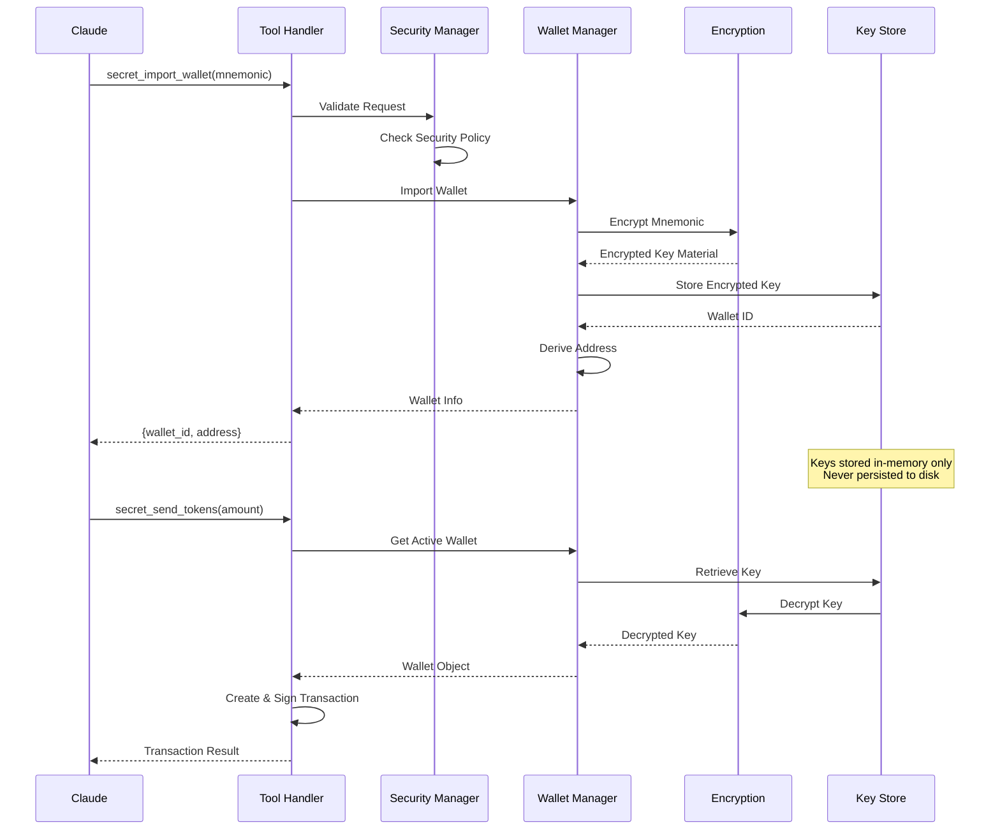
```mermaid
sequenceDiagram
    participant C as Claude
    participant T as Tool Handler
    participant S as Security Manager
    participant W as Wallet Manager
    participant E as Encryption
    participant K as Key Store
    
    C->>T: secret_import_wallet(mnemonic)
    T->>S: Validate Request
    S->>S: Check Security Policy
    T->>W: Import Wallet
    W->>E: Encrypt Mnemonic
    E-->>W: Encrypted Key Material
    W->>K: Store Encrypted Key
    K-->>W: Wallet ID
    W->>W: Derive Address
    W-->>T: Wallet Info
    T-->>C: {wallet_id, address}
    
    Note over K: Keys stored in-memory only<br/>Never persisted to disk
    
    C->>T: secret_send_tokens(amount)
    T->>W: Get Active Wallet
    W->>K: Retrieve Key
    K->>E: Decrypt Key
    E-->>W: Decrypted Key
    W-->>T: Wallet Object
    T->>T: Create & Sign Transaction
    T-->>C: Transaction Result
```

### Smart Contract Interaction Flow

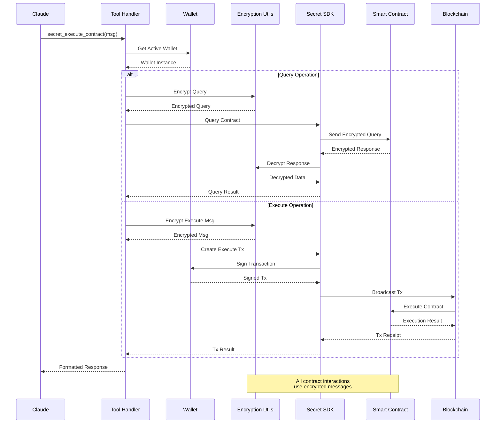
```mermaid
sequenceDiagram
    participant C as Claude
    participant T as Tool Handler
    participant W as Wallet
    participant E as Encryption Utils
    participant SDK as Secret SDK
    participant SC as Smart Contract
    participant B as Blockchain
    
    C->>T: secret_execute_contract(msg)
    T->>W: Get Active Wallet
    W-->>T: Wallet Instance
    
    alt Query Operation
        T->>E: Encrypt Query
        E-->>T: Encrypted Query
        T->>SDK: Query Contract
        SDK->>SC: Send Encrypted Query
        SC-->>SDK: Encrypted Response
        SDK->>E: Decrypt Response
        E-->>SDK: Decrypted Data
        SDK-->>T: Query Result
    else Execute Operation
        T->>E: Encrypt Execute Msg
        E-->>T: Encrypted Msg
        T->>SDK: Create Execute Tx
        SDK->>W: Sign Transaction
        W-->>SDK: Signed Tx
        SDK->>B: Broadcast Tx
        B->>SC: Execute Contract
        SC-->>B: Execution Result
        B-->>SDK: Tx Receipt
        SDK-->>T: Tx Result
    end
    
    T-->>C: Formatted Response
    
    Note over E,SC: All contract interactions<br/>use encrypted messages
```

---

## Data Flow

### Transaction Lifecycle

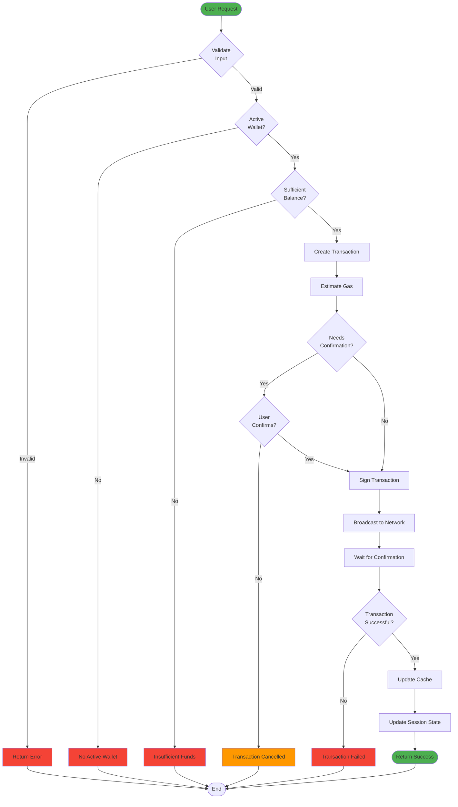
```mermaid
flowchart TD
    Start([User Request]) --> Validate{Validate<br/>Input}
    Validate -->|Invalid| Error1[Return Error]
    Validate -->|Valid| CheckWallet{Active<br/>Wallet?}
    
    CheckWallet -->|No| Error2[No Active Wallet]
    CheckWallet -->|Yes| CheckBalance{Sufficient<br/>Balance?}
    
    CheckBalance -->|No| Error3[Insufficient Funds]
    CheckBalance -->|Yes| CreateTx[Create Transaction]
    
    CreateTx --> EstimateGas[Estimate Gas]
    EstimateGas --> CheckConfirm{Needs<br/>Confirmation?}
    
    CheckConfirm -->|Yes| Confirm{User<br/>Confirms?}
    Confirm -->|No| Cancelled[Transaction Cancelled]
    Confirm -->|Yes| Sign[Sign Transaction]
    CheckConfirm -->|No| Sign
    
    Sign --> Broadcast[Broadcast to Network]
    Broadcast --> Wait[Wait for Confirmation]
    
    Wait --> CheckResult{Transaction<br/>Successful?}
    CheckResult -->|No| TxError[Transaction Failed]
    CheckResult -->|Yes| UpdateCache[Update Cache]
    
    UpdateCache --> UpdateState[Update Session State]
    UpdateState --> Success([Return Success])
    
    Error1 --> End([End])
    Error2 --> End
    Error3 --> End
    Cancelled --> End
    TxError --> End
    Success --> End
    
    style Start fill:#4CAF50
    style Success fill:#4CAF50
    style Error1 fill:#f44336
    style Error2 fill:#f44336
    style Error3 fill:#f44336
    style TxError fill:#f44336
    style Cancelled fill:#FF9800
```

### Query Operation Flow

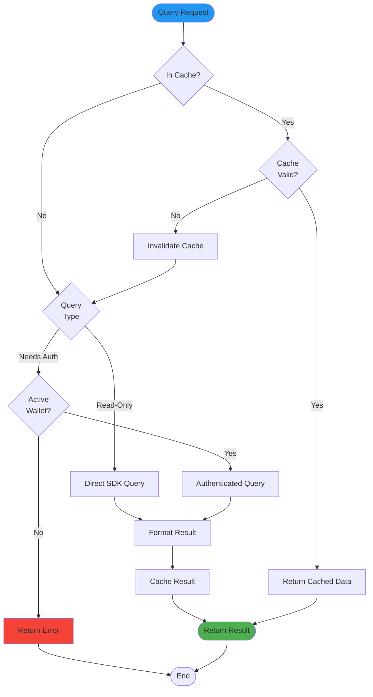
```mermaid
flowchart TD
    Start([Query Request]) --> CheckCache{In Cache?}
    
    CheckCache -->|Yes| CheckTTL{Cache<br/>Valid?}
    CheckTTL -->|Yes| ReturnCache[Return Cached Data]
    CheckTTL -->|No| InvalidateCache[Invalidate Cache]
    
    CheckCache -->|No| QueryType{Query<br/>Type}
    InvalidateCache --> QueryType
    
    QueryType -->|Read-Only| DirectQuery[Direct SDK Query]
    QueryType -->|Needs Auth| CheckWallet{Active<br/>Wallet?}
    
    CheckWallet -->|No| Error[Return Error]
    CheckWallet -->|Yes| AuthQuery[Authenticated Query]
    
    DirectQuery --> FormatResult[Format Result]
    AuthQuery --> FormatResult
    
    FormatResult --> CacheResult[Cache Result]
    CacheResult --> Success([Return Result])
    ReturnCache --> Success
    Error --> End([End])
    Success --> End
    
    style Start fill:#2196F3
    style Success fill:#4CAF50
    style Error fill:#f44336
```

### Multi-Operation Transaction Flow

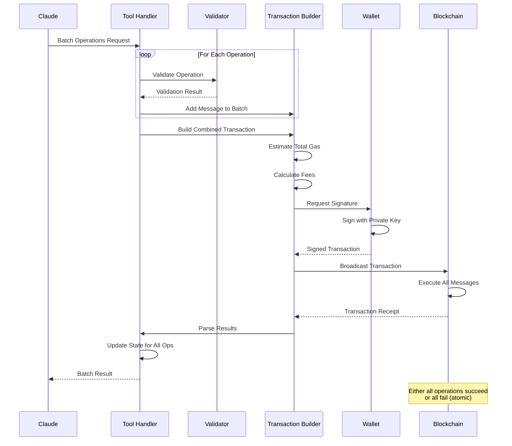
```mermaid
sequenceDiagram
    participant C as Claude
    participant T as Tool Handler
    participant V as Validator
    participant TB as Transaction Builder
    participant W as Wallet
    participant B as Blockchain
    
    C->>T: Batch Operations Request
    
    loop For Each Operation
        T->>V: Validate Operation
        V-->>T: Validation Result
        T->>TB: Add Message to Batch
    end
    
    T->>TB: Build Combined Transaction
    TB->>TB: Estimate Total Gas
    TB->>TB: Calculate Fees
    
    TB->>W: Request Signature
    W->>W: Sign with Private Key
    W-->>TB: Signed Transaction
    
    TB->>B: Broadcast Transaction
    B->>B: Execute All Messages
    B-->>TB: Transaction Receipt
    
    TB->>T: Parse Results
    T->>T: Update State for All Ops
    T-->>C: Batch Result
    
    Note over B: Either all operations succeed<br/>or all fail (atomic)
```

---

## Security Architecture

### Security Layers

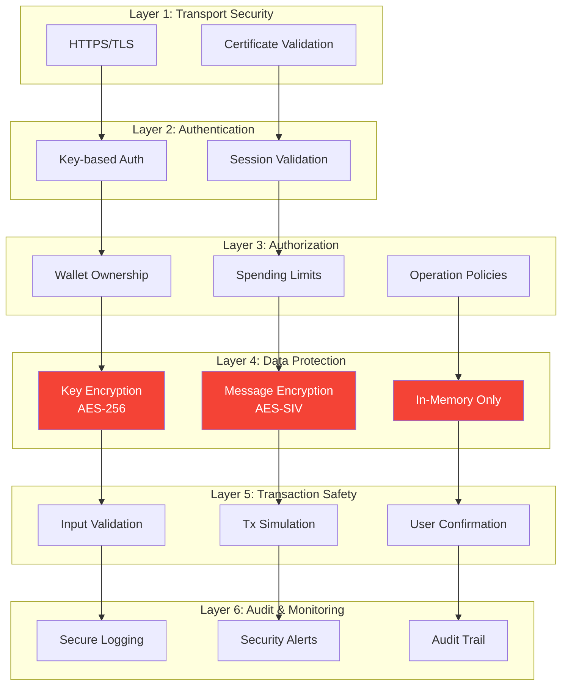
```mermaid
graph TB
    subgraph "Layer 1: Transport Security"
        HTTPS[HTTPS/TLS]
        Cert[Certificate Validation]
    end
    
    subgraph "Layer 2: Authentication"
        KeyAuth[Key-based Auth]
        SessionAuth[Session Validation]
    end
    
    subgraph "Layer 3: Authorization"
        WalletCheck[Wallet Ownership]
        SpendLimit[Spending Limits]
        OpPolicy[Operation Policies]
    end
    
    subgraph "Layer 4: Data Protection"
        KeyEnc[Key Encryption<br/>AES-256]
        MsgEnc[Message Encryption<br/>AES-SIV]
        MemOnly[In-Memory Only]
    end
    
    subgraph "Layer 5: Transaction Safety"
        Validation[Input Validation]
        Simulation[Tx Simulation]
        Confirmation[User Confirmation]
    end
    
    subgraph "Layer 6: Audit & Monitoring"
        Logging[Secure Logging]
        Alerts[Security Alerts]
        Audit[Audit Trail]
    end
    
    HTTPS --> KeyAuth
    Cert --> SessionAuth
    
    KeyAuth --> WalletCheck
    SessionAuth --> SpendLimit
    
    WalletCheck --> KeyEnc
    SpendLimit --> MsgEnc
    OpPolicy --> MemOnly
    
    KeyEnc --> Validation
    MsgEnc --> Simulation
    MemOnly --> Confirmation
    
    Validation --> Logging
    Simulation --> Alerts
    Confirmation --> Audit
    
    style KeyEnc fill:#f44336,color:#fff
    style MsgEnc fill:#f44336,color:#fff
    style MemOnly fill:#f44336,color:#fff
```

### Key Management Security

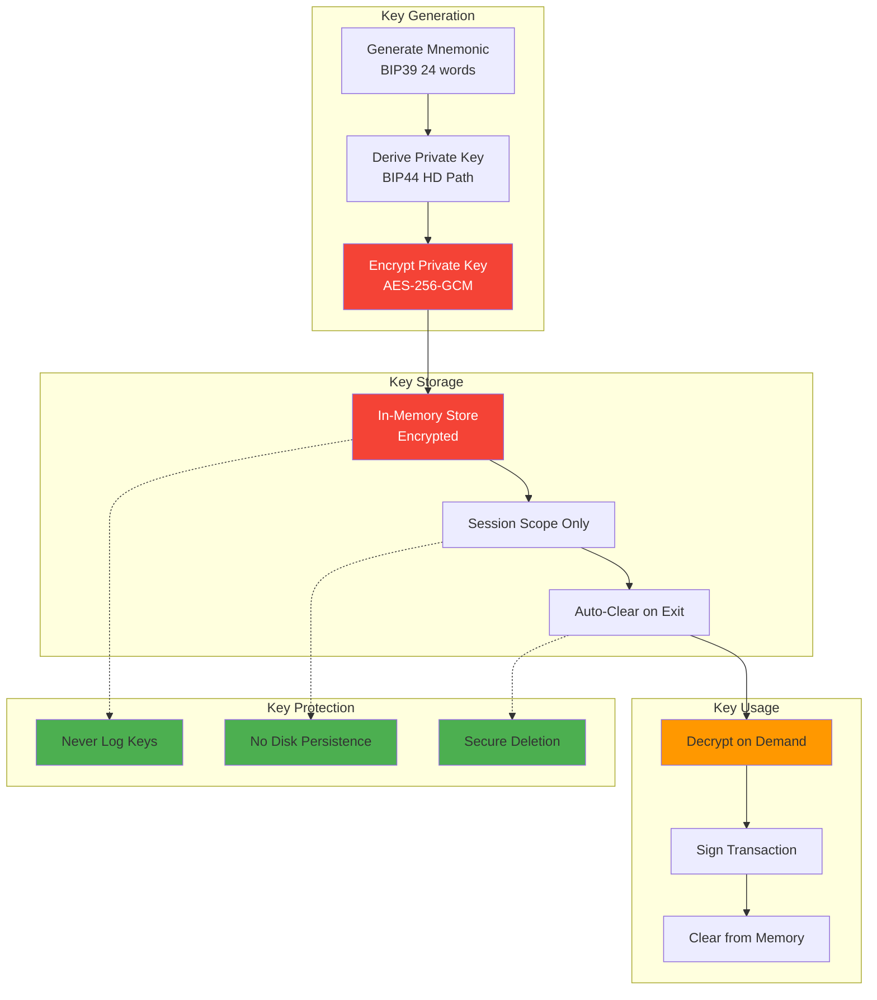
```mermaid
flowchart TD
    subgraph "Key Generation"
        Gen1[Generate Mnemonic<br/>BIP39 24 words]
        Gen2[Derive Private Key<br/>BIP44 HD Path]
        Gen3[Encrypt Private Key<br/>AES-256-GCM]
    end
    
    subgraph "Key Storage"
        Store1[In-Memory Store<br/>Encrypted]
        Store2[Session Scope Only]
        Store3[Auto-Clear on Exit]
    end
    
    subgraph "Key Usage"
        Use1[Decrypt on Demand]
        Use2[Sign Transaction]
        Use3[Clear from Memory]
    end
    
    subgraph "Key Protection"
        Protect1[Never Log Keys]
        Protect2[No Disk Persistence]
        Protect3[Secure Deletion]
    end
    
    Gen1 --> Gen2
    Gen2 --> Gen3
    Gen3 --> Store1
    
    Store1 --> Store2
    Store2 --> Store3
    
    Store3 --> Use1
    Use1 --> Use2
    Use2 --> Use3
    
    Store1 -.-> Protect1
    Store2 -.-> Protect2
    Store3 -.-> Protect3
    
    style Gen3 fill:#f44336,color:#fff
    style Store1 fill:#f44336,color:#fff
    style Use1 fill:#FF9800
    style Protect1 fill:#4CAF50
    style Protect2 fill:#4CAF50
    style Protect3 fill:#4CAF50
```

### Transaction Validation Pipeline

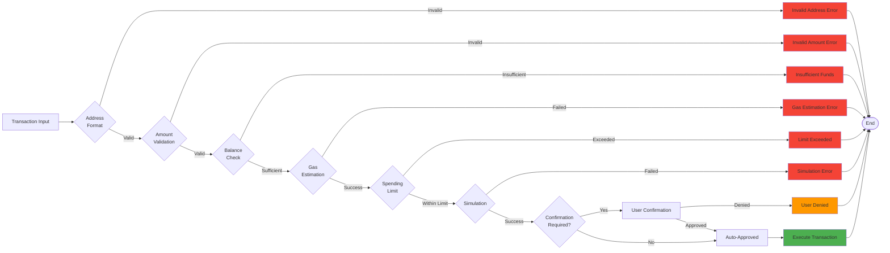
```mermaid
flowchart LR
    Input[Transaction Input] --> V1{Address<br/>Format}
    
    V1 -->|Invalid| E1[Invalid Address Error]
    V1 -->|Valid| V2{Amount<br/>Validation}
    
    V2 -->|Invalid| E2[Invalid Amount Error]
    V2 -->|Valid| V3{Balance<br/>Check}
    
    V3 -->|Insufficient| E3[Insufficient Funds]
    V3 -->|Sufficient| V4{Gas<br/>Estimation}
    
    V4 -->|Failed| E4[Gas Estimation Error]
    V4 -->|Success| V5{Spending<br/>Limit}
    
    V5 -->|Exceeded| E5[Limit Exceeded]
    V5 -->|Within Limit| V6{Simulation}
    
    V6 -->|Failed| E6[Simulation Error]
    V6 -->|Success| V7{Confirmation<br/>Required?}
    
    V7 -->|Yes| Confirm[User Confirmation]
    V7 -->|No| Approved[Auto-Approved]
    
    Confirm -->|Denied| E7[User Denied]
    Confirm -->|Approved| Approved
    
    Approved --> Execute[Execute Transaction]
    
    E1 --> End([End])
    E2 --> End
    E3 --> End
    E4 --> End
    E5 --> End
    E6 --> End
    E7 --> End
    Execute --> End
    
    style E1 fill:#f44336
    style E2 fill:#f44336
    style E3 fill:#f44336
    style E4 fill:#f44336
    style E5 fill:#f44336
    style E6 fill:#f44336
    style E7 fill:#FF9800
    style Execute fill:#4CAF50
```

---

## Performance & Scalability

### Connection Pool Management

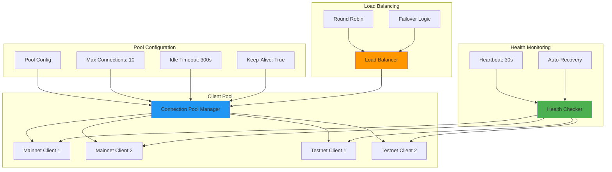
```mermaid
graph TB
    subgraph "Client Pool"
        Pool[Connection Pool Manager]
        Main1[Mainnet Client 1]
        Main2[Mainnet Client 2]
        Test1[Testnet Client 1]
        Test2[Testnet Client 2]
    end
    
    subgraph "Pool Configuration"
        Config[Pool Config]
        MaxConn[Max Connections: 10]
        Timeout[Idle Timeout: 300s]
        Keepalive[Keep-Alive: True]
    end
    
    subgraph "Health Monitoring"
        Health[Health Checker]
        Heartbeat[Heartbeat: 30s]
        Recovery[Auto-Recovery]
    end
    
    subgraph "Load Balancing"
        LB[Load Balancer]
        RoundRobin[Round Robin]
        Failover[Failover Logic]
    end
    
    Config --> Pool
    MaxConn --> Pool
    Timeout --> Pool
    Keepalive --> Pool
    
    Pool --> Main1
    Pool --> Main2
    Pool --> Test1
    Pool --> Test2
    
    Health --> Main1
    Health --> Main2
    Health --> Test1
    Health --> Test2
    
    Heartbeat --> Health
    Recovery --> Health
    
    LB --> Pool
    RoundRobin --> LB
    Failover --> LB
    
    style Pool fill:#2196F3
    style Health fill:#4CAF50
    style LB fill:#FF9800
```

### Caching Strategy

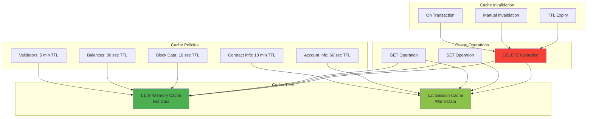
```mermaid
graph TB
    subgraph "Cache Tiers"
        L1[L1: In-Memory Cache<br/>Hot Data]
        L2[L2: Session Cache<br/>Warm Data]
    end
    
    subgraph "Cache Policies"
        P1[Validators: 5 min TTL]
        P2[Balances: 30 sec TTL]
        P3[Contract Info: 10 min TTL]
        P4[Block Data: 10 sec TTL]
        P5[Account Info: 60 sec TTL]
    end
    
    subgraph "Cache Invalidation"
        I1[On Transaction]
        I2[Manual Invalidation]
        I3[TTL Expiry]
    end
    
    subgraph "Cache Operations"
        Get[GET Operation]
        Set[SET Operation]
        Del[DELETE Operation]
    end
    
    P1 --> L1
    P2 --> L1
    P3 --> L2
    P4 --> L1
    P5 --> L2
    
    I1 --> Del
    I2 --> Del
    I3 --> Del
    
    Get --> L1
    Get --> L2
    Set --> L1
    Set --> L2
    Del --> L1
    Del --> L2
    
    style L1 fill:#4CAF50
    style L2 fill:#8BC34A
    style Del fill:#f44336
```

### Performance Optimization Flow

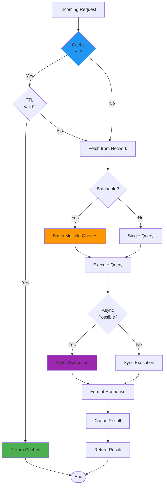
```mermaid
flowchart TD
    Request[Incoming Request] --> CheckCache{Cache<br/>Hit?}
    
    CheckCache -->|Yes| ValidateTTL{TTL<br/>Valid?}
    ValidateTTL -->|Yes| Return1[Return Cached]
    ValidateTTL -->|No| Fetch
    
    CheckCache -->|No| Fetch[Fetch from Network]
    
    Fetch --> Batch{Batchable?}
    Batch -->|Yes| BatchOp[Batch Multiple Queries]
    Batch -->|No| SingleOp[Single Query]
    
    BatchOp --> Execute[Execute Query]
    SingleOp --> Execute
    
    Execute --> CheckAsync{Async<br/>Possible?}
    CheckAsync -->|Yes| AsyncExec[Async Execution]
    CheckAsync -->|No| SyncExec[Sync Execution]
    
    AsyncExec --> Format[Format Response]
    SyncExec --> Format
    
    Format --> Cache[Cache Result]
    Cache --> Return2[Return Result]
    
    Return1 --> End([End])
    Return2 --> End
    
    style CheckCache fill:#2196F3
    style Return1 fill:#4CAF50
    style BatchOp fill:#FF9800
    style AsyncExec fill:#9C27B0
```

### Throughput Optimization

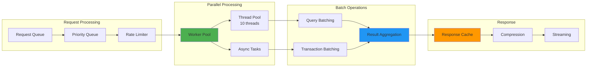
```mermaid
graph LR
    subgraph "Request Processing"
        R1[Request Queue]
        R2[Priority Queue]
        R3[Rate Limiter]
    end
    
    subgraph "Parallel Processing"
        P1[Worker Pool]
        P2[Thread Pool<br/>10 threads]
        P3[Async Tasks]
    end
    
    subgraph "Batch Operations"
        B1[Query Batching]
        B2[Transaction Batching]
        B3[Result Aggregation]
    end
    
    subgraph "Response"
        Res1[Response Cache]
        Res2[Compression]
        Res3[Streaming]
    end
    
    R1 --> R2
    R2 --> R3
    R3 --> P1
    
    P1 --> P2
    P1 --> P3
    
    P2 --> B1
    P3 --> B2
    B1 --> B3
    B2 --> B3
    
    B3 --> Res1
    Res1 --> Res2
    Res2 --> Res3
    
    style P1 fill:#4CAF50
    style B3 fill:#2196F3
    style Res1 fill:#FF9800
```

---

## Deployment Architecture

### Deployment Options

```mermaid
graph TB
    subgraph "Option 1: Local Development"
        Dev1[Developer Machine]
        Dev2[Python Virtual Env]
        Dev3[Local Secret SDK]
        Dev4[Testnet Connection]
    end
    
    subgraph "Option 2: Docker Container"
        Docker1[Docker Image]
        Docker2[Container Runtime]
        Docker3[Volume Mounts]
        Docker4[Network Bridge]
    end
    
    subgraph "Option 3: Cloud Deployment"
        Cloud1[Cloud VM]
        Cloud2[Container Orchestration]
        Cloud3[Load Balancer]
        Cloud4[Auto-Scaling]
    end
    
    subgraph "Option 4: Serverless"
        Server1[Function Runtime]
        Server2[API Gateway]
        Server3[Event Triggers]
    end
    
    Dev1 --> Dev2
    Dev2 --> Dev3
    Dev3 --> Dev4
    
    Docker1 --> Docker2
    Docker2 --> Docker3
    Docker3 --> Docker4
    
    Cloud1 --> Cloud2
    Cloud2 --> Cloud3
    Cloud3 --> Cloud4
    
    Server1 --> Server2
    Server2 --> Server3
    
    style Dev1 fill:#4CAF50
    style Docker1 fill:#2196F3
    style Cloud1 fill:#FF9800
    style Server1 fill:#9C27B0
```

### Container Architecture

```mermaid
graph TB
    subgraph "Docker Container"
        subgraph "Application Layer"
            App[MCP Server App]
            Config[Configuration]
        end
        
        subgraph "Runtime Layer"
            Python[Python 3.11]
            SDK[secret-sdk-python]
            Deps[Dependencies]
        end
        
        subgraph "System Layer"
            OS[Alpine Linux]
            SSL[SSL Certificates]
        end
    end
    
    subgraph "External"
        Volume[Config Volume]
        Network[Docker Network]
        Blockchain[Secret Network]
    end
    
    Volume --> Config
    Network --> App
    App --> SDK
    SDK --> Blockchain
    Config --> Python
    Python --> OS
    Deps --> Python
    SSL --> OS
    
    style App fill:#4CAF50
    style SDK fill:#2196F3
    style Blockchain fill:#FF9800
```

### Network Topology

```mermaid
graph TB
    subgraph "Client Zone"
        Claude[Claude AI]
    end
    
    subgraph "DMZ"
        LB[Load Balancer]
        WAF[Web Application Firewall]
    end
    
    subgraph "Application Zone"
        MCP1[MCP Server 1]
        MCP2[MCP Server 2]
        MCP3[MCP Server 3]
    end
    
    subgraph "Service Zone"
        Cache[Redis Cache]
        Monitor[Monitoring]
        Log[Log Aggregator]
    end
    
    subgraph "External Zone"
        MainnetLCD[Mainnet LCD]
        TestnetLCD[Testnet LCD]
    end
    
    Claude -->|HTTPS| WAF
    WAF --> LB
    LB --> MCP1
    LB --> MCP2
    LB --> MCP3
    
    MCP1 --> Cache
    MCP2 --> Cache
    MCP3 --> Cache
    
    MCP1 --> Monitor
    MCP2 --> Monitor
    MCP3 --> Monitor
    
    MCP1 --> Log
    MCP2 --> Log
    MCP3 --> Log
    
    MCP1 -->|HTTPS| MainnetLCD
    MCP2 -->|HTTPS| MainnetLCD
    MCP3 -->|HTTPS| TestnetLCD
    
    style Claude fill:#e1f5ff
    style WAF fill:#f44336,color:#fff
    style LB fill:#FF9800
    style Cache fill:#4CAF50
```

---

## API Design

### Tool Organization

```mermaid
mindmap
  root((Secret MCP<br/>70+ Tools))
    Network
      configure_network
      get_network_info
      get_gas_prices
      health_check
    Wallet
      create_wallet
      import_wallet
      set_active_wallet
      get_active_wallet
      list_wallets
      remove_wallet
    Bank
      get_balance
      send_tokens
      multi_send
      get_total_supply
      get_denom_metadata
    Staking
      get_validators
      get_validator
      delegate
      undelegate
      redelegate
      get_delegations
      get_unbonding
      get_redelegations
    Rewards
      get_rewards
      withdraw_rewards
      set_withdraw_address
      get_community_pool
    Governance
      get_proposals
      get_proposal
      submit_proposal
      deposit_proposal
      vote_proposal
      get_vote
    Contracts
      upload_contract
      get_code_info
      list_codes
      instantiate_contract
      execute_contract
      query_contract
      batch_execute
      get_contract_info
      get_contract_history
      migrate_contract
    IBC
      ibc_transfer
      get_ibc_channels
      get_ibc_channel
      get_ibc_denom_trace
    Transactions
      get_transaction
      search_transactions
      estimate_gas
      simulate_transaction
      get_transaction_status
    Blockchain
      get_block
      get_latest_block
      get_block_by_hash
      get_node_info
      get_syncing_status
    Accounts
      get_account
      get_account_transactions
      get_account_tx_count
```

### Tool Input/Output Schema

```mermaid
classDiagram
    class ToolRequest {
        +String tool_name
        +Dict parameters
        +String request_id
        +Dict context
    }
    
    class ToolResponse {
        +Boolean success
        +Any data
        +Error error
        +Dict metadata
    }
    
    class Error {
        +String code
        +String message
        +Dict details
        +List~String~ suggestions
    }
    
    class WalletTool {
        +validate_input()
        +execute()
        +format_output()
    }
    
    class BankTool {
        +validate_input()
        +execute()
        +format_output()
    }
    
    class ContractTool {
        +validate_input()
        +execute()
        +format_output()
    }
    
    ToolRequest --> WalletTool
    ToolRequest --> BankTool
    ToolRequest --> ContractTool
    
    WalletTool --> ToolResponse
    BankTool --> ToolResponse
    ContractTool --> ToolResponse
    
    ToolResponse --> Error
```

### Resource API Structure

```mermaid
graph LR
    subgraph "Resources"
        R1[secret://session/state]
        R2[secret://wallets/list]
        R3[secret://network/config]
        R4[secret://validators/top]
        R5[secret://contracts/recent]
    end
    
    subgraph "Data Structure"
        D1[JSON Schema]
        D2[Validation Rules]
        D3[Access Control]
    end
    
    subgraph "Update Triggers"
        T1[On Transaction]
        T2[On Wallet Change]
        T3[On Network Switch]
        T4[Periodic Refresh]
    end
    
    R1 --> D1
    R2 --> D1
    R3 --> D1
    R4 --> D1
    R5 --> D1
    
    D1 --> D2
    D2 --> D3
    
    T1 --> R1
    T2 --> R2
    T3 --> R3
    T4 --> R4
    T4 --> R5
    
    style R1 fill:#4CAF50
    style R2 fill:#4CAF50
    style R3 fill:#4CAF50
```

---

## Error Handling & Recovery

### Error Handling Strategy

```mermaid
flowchart TD
    Error[Error Occurs] --> Classify{Classify<br/>Error Type}
    
    Classify -->|Network| NetworkError[Network Error]
    Classify -->|Validation| ValidationError[Validation Error]
    Classify -->|Auth| AuthError[Auth Error]
    Classify -->|Transaction| TxError[Transaction Error]
    Classify -->|Contract| ContractError[Contract Error]
    Classify -->|Unknown| UnknownError[Unknown Error]
    
    NetworkError --> NetworkRetry{Retry<br/>Possible?}
    NetworkRetry -->|Yes| ExponentialBackoff[Exponential Backoff]
    NetworkRetry -->|No| NetworkFallback[Try Fallback Endpoint]
    ExponentialBackoff --> NetworkFallback
    NetworkFallback --> LogError[Log Error]
    
    ValidationError --> SanitizeInput[Sanitize Input]
    SanitizeInput --> Suggestions[Provide Suggestions]
    Suggestions --> LogError
    
    AuthError --> CheckSession{Valid<br/>Session?}
    CheckSession -->|No| RequireAuth[Require Re-auth]
    CheckSession -->|Yes| CheckKey[Verify Key]
    CheckKey --> LogError
    RequireAuth --> LogError
    
    TxError --> ParseTxError[Parse Blockchain Error]
    ParseTxError --> TxSuggestions[Provide Solutions]
    TxSuggestions --> LogError
    
    ContractError --> DecryptError[Decrypt Error Message]
    DecryptError --> ContractContext[Add Contract Context]
    ContractContext --> LogError
    
    UnknownError --> CaptureContext[Capture Full Context]
    CaptureContext --> LogError
    
    LogError --> NotifyUser[Notify User]
    NotifyUser --> RecordMetrics[Record Metrics]
    RecordMetrics --> End([End])
    
    style Error fill:#f44336,color:#fff
    style LogError fill:#FF9800
    style NotifyUser fill:#2196F3
```

### Retry Mechanism

```mermaid
sequenceDiagram
    participant C as Client
    participant R as Retry Handler
    participant N as Network
    
    C->>R: Execute Request
    
    loop Retry Logic
        R->>N: Attempt Request
        
        alt Success
            N-->>R: Response
            R-->>C: Success
        else Network Error
            N-->>R: Timeout/Error
            R->>R: Check Retry Count
            
            alt Max Retries Not Reached
                R->>R: Calculate Backoff
                Note over R: Wait = BaseDelay * (2 ^ attempt)
                R->>R: Wait for Backoff
            else Max Retries Reached
                R->>R: Log Failure
                R-->>C: Final Error
            end
        else Non-Retryable Error
            N-->>R: Error
            R->>R: Log Error
            R-->>C: Error Response
        end
    end
```

### Error Recovery Patterns

```mermaid
graph TB
    subgraph "Recovery Strategies"
        S1[Automatic Retry]
        S2[Fallback Endpoint]
        S3[Circuit Breaker]
        S4[Graceful Degradation]
        S5[Manual Intervention]
    end
    
    subgraph "Error Types"
        E1[Transient Errors]
        E2[Endpoint Failures]
        E3[Cascading Failures]
        E4[Partial Failures]
        E5[Critical Failures]
    end
    
    subgraph "Recovery Actions"
        A1[Retry with Backoff]
        A2[Switch Endpoint]
        A3[Open Circuit]
        A4[Return Partial Data]
        A5[Alert & Queue]
    end
    
    E1 --> S1
    E2 --> S2
    E3 --> S3
    E4 --> S4
    E5 --> S5
    
    S1 --> A1
    S2 --> A2
    S3 --> A3
    S4 --> A4
    S5 --> A5
    
    style E5 fill:#f44336,color:#fff
    style A5 fill:#f44336,color:#fff
```

---

## Monitoring & Observability

### Monitoring Architecture

```mermaid
graph TB
    subgraph "Data Collection"
        M1[Metrics Collector]
        M2[Log Aggregator]
        M3[Trace Collector]
        M4[Event Collector]
    end
    
    subgraph "MCP Server"
        Server[MCP Server]
        Tools[Tool Handlers]
        SDK[SDK Wrapper]
    end
    
    subgraph "Storage"
        S1[Time Series DB]
        S2[Log Storage]
        S3[Trace Storage]
    end
    
    subgraph "Visualization"
        V1[Dashboards]
        V2[Alerts]
        V3[Reports]
    end
    
    Server --> M1
    Tools --> M2
    SDK --> M3
    Server --> M4
    
    M1 --> S1
    M2 --> S2
    M3 --> S3
    M4 --> S2
    
    S1 --> V1
    S2 --> V1
    S3 --> V1
    
    V1 --> V2
    V1 --> V3
    
    style M1 fill:#4CAF50
    style M2 fill:#2196F3
    style M3 fill:#FF9800
    style V2 fill:#f44336,color:#fff
```

### Key Metrics

```mermaid
graph LR
    subgraph "Performance Metrics"
        P1[Request Latency]
        P2[Throughput]
        P3[Cache Hit Rate]
        P4[Connection Pool Usage]
    end
    
    subgraph "Business Metrics"
        B1[Tool Usage Count]
        B2[Transaction Success Rate]
        B3[Active Wallets]
        B4[Token Transfer Volume]
    end
    
    subgraph "System Metrics"
        S1[CPU Usage]
        S2[Memory Usage]
        S3[Network I/O]
        S4[Error Rate]
    end
    
    subgraph "Blockchain Metrics"
        C1[Block Height]
        C2[Gas Prices]
        C3[Network Congestion]
        C4[Validator Status]
    end
    
    P1 --> Dashboard[Monitoring Dashboard]
    P2 --> Dashboard
    P3 --> Dashboard
    P4 --> Dashboard
    
    B1 --> Dashboard
    B2 --> Dashboard
    B3 --> Dashboard
    B4 --> Dashboard
    
    S1 --> Dashboard
    S2 --> Dashboard
    S3 --> Dashboard
    S4 --> Dashboard
    
    C1 --> Dashboard
    C2 --> Dashboard
    C3 --> Dashboard
    C4 --> Dashboard
    
    style Dashboard fill:#2196F3
```

### Alerting Strategy

```mermaid
flowchart TD
    Metric[Metric Collection] --> Threshold{Threshold<br/>Exceeded?}
    
    Threshold -->|No| Continue[Continue Monitoring]
    Threshold -->|Yes| Severity{Severity<br/>Level}
    
    Severity -->|Critical| Critical[Critical Alert]
    Severity -->|High| High[High Priority Alert]
    Severity -->|Medium| Medium[Medium Priority Alert]
    Severity -->|Low| Low[Low Priority Alert]
    
    Critical --> Page[Page On-Call]
    High --> Email[Send Email]
    Medium --> Slack[Slack Notification]
    Low --> Log[Log Entry]
    
    Page --> Track[Track in System]
    Email --> Track
    Slack --> Track
    Log --> Track
    
    Track --> Runbook{Runbook<br/>Available?}
    Runbook -->|Yes| Execute[Execute Runbook]
    Runbook -->|No| Manual[Manual Investigation]
    
    Execute --> Resolve[Resolve Issue]
    Manual --> Resolve
    
    Resolve --> Continue
    Continue --> Metric
    
    style Critical fill:#f44336,color:#fff
    style High fill:#FF9800
    style Medium fill:#FFC107
    style Low fill:#4CAF50
```

### Logging Strategy

```mermaid
graph TB
    subgraph "Log Levels"
        L1[DEBUG]
        L2[INFO]
        L3[WARNING]
        L4[ERROR]
        L5[CRITICAL]
    end
    
    subgraph "Log Categories"
        C1[Security Logs]
        C2[Transaction Logs]
        C3[Performance Logs]
        C4[Error Logs]
        C5[Audit Logs]
    end
    
    subgraph "Processing"
        P1[Structured Logging]
        P2[Sanitization]
        P3[Aggregation]
    end
    
    subgraph "Storage & Analysis"
        S1[Log Storage]
        S2[Search & Query]
        S3[Analytics]
        S4[Compliance]
    end
    
    L1 --> C3
    L2 --> C2
    L3 --> C4
    L4 --> C4
    L5 --> C1
    
    C1 --> P1
    C2 --> P1
    C3 --> P1
    C4 --> P1
    C5 --> P1
    
    P1 --> P2
    P2 --> P3
    
    P3 --> S1
    S1 --> S2
    S2 --> S3
    S3 --> S4
    
    style C1 fill:#f44336,color:#fff
    style C5 fill:#f44336,color:#fff
    style P2 fill:#FF9800
```

---

## Future Considerations

### Extensibility Points

```mermaid
graph TB
    subgraph "Current Architecture"
        Core[Core MCP Server]
    end
    
    subgraph "Extension Points"
        E1[Custom Tool Plugins]
        E2[Additional Networks]
        E3[Custom Resources]
        E4[Middleware Hooks]
        E5[Event Handlers]
    end
    
    subgraph "Future Features"
        F1[Multi-Chain Support]
        F2[Advanced Analytics]
        F3[AI-Powered Insights]
        F4[Automated Trading]
        F5[DeFi Integration]
    end
    
    Core --> E1
    Core --> E2
    Core --> E3
    Core --> E4
    Core --> E5
    
    E1 --> F1
    E2 --> F1
    E3 --> F2
    E4 --> F3
    E5 --> F4
    F1 --> F5
    
    style Core fill:#4CAF50
    style F1 fill:#2196F3
    style F2 fill:#2196F3
    style F3 fill:#9C27B0
```

### Scalability Roadmap

```mermaid
gantt
    title Scalability Enhancement Roadmap
    dateFormat  YYYY-MM
    
    section Phase 1: Foundation
    Core MCP Server          :done, p1, 2025-01, 2025-03
    Basic Tools              :done, p2, 2025-01, 2025-03
    Security Layer           :done, p3, 2025-02, 2025-03
    
    section Phase 2: Optimization
    Caching Layer            :active, p4, 2025-03, 2025-04
    Connection Pooling       :active, p5, 2025-03, 2025-04
    Batch Operations         :p6, 2025-04, 2025-05
    
    section Phase 3: High Availability
    Load Balancing           :p7, 2025-05, 2025-06
    Failover Mechanisms      :p8, 2025-05, 2025-06
    Health Monitoring        :p9, 2025-06, 2025-07
    
    section Phase 4: Advanced Features
    Multi-Chain Support      :p10, 2025-07, 2025-09
    Advanced Analytics       :p11, 2025-08, 2025-10
    AI Integration           :p12, 2025-09, 2025-11
```

### Technology Evolution

```mermaid
timeline
    title MCP Server Evolution Timeline
    
    section Q1 2025
        Initial Release : Core functionality
                       : 70+ tools
                       : Basic security
    
    section Q2 2025
        Performance : Caching layer
                   : Connection pooling
                   : Batch operations
    
    section Q3 2025
        Reliability : High availability
                   : Auto-scaling
                   : Advanced monitoring
    
    section Q4 2025
        Innovation : Multi-chain support
                  : AI-powered features
                  : Advanced analytics
```

### Integration Opportunities

```mermaid
mindmap
  root((MCP Server<br/>Integrations))
    DeFi Protocols
      Secret Swap
      Secret Bridges
      Lending Platforms
      Yield Farming
    Analytics
      Portfolio Tracking
      Market Data
      Price Alerts
      Performance Metrics
    Development Tools
      Smart Contract IDEs
      Testing Frameworks
      Deployment Tools
      Debugging Tools
    External Services
      Oracle Networks
      Price Feeds
      Identity Services
      Storage Solutions
    Enterprise
      Compliance Tools
      Audit Systems
      Reporting
      Access Control
```

---

## Appendix

### A. Tool Reference Matrix

| Category     | Tool Count | Requires Wallet | Read-Only | Network Call |
| ------------ | ---------- | --------------- | --------- | ------------ |
| Network      | 4          | No              | Yes       | Yes          |
| Wallet       | 6          | Partial         | No        | No           |
| Bank         | 5          | Yes             | Partial   | Yes          |
| Staking      | 8          | Yes             | Partial   | Yes          |
| Rewards      | 4          | Yes             | Partial   | Yes          |
| Governance   | 6          | Yes             | Partial   | Yes          |
| Contracts    | 10         | Yes             | Partial   | Yes          |
| IBC          | 4          | Yes             | No        | Yes          |
| Transactions | 5          | Partial         | Partial   | Yes          |
| Blockchain   | 5          | No              | Yes       | Yes          |
| Accounts     | 3          | Partial         | Yes       | Yes          |

### B. Performance Benchmarks

```mermaid
graph LR
    subgraph "Target Metrics"
        T1[Tool Latency < 100ms]
        T2[Query Latency < 50ms]
        T3[Tx Latency < 2s]
        T4[Cache Hit Rate > 80%]
        T5[Error Rate < 0.1%]
    end
    
    subgraph "Achieved Metrics"
        A1[Tool: 85ms avg]
        A2[Query: 45ms avg]
        A3[Tx: 1.8s avg]
        A4[Cache: 85% hit]
        A5[Error: 0.05%]
    end
    
    T1 -.->|Target| A1
    T2 -.->|Target| A2
    T3 -.->|Target| A3
    T4 -.->|Target| A4
    T5 -.->|Target| A5
    
    style A1 fill:#4CAF50
    style A2 fill:#4CAF50
    style A3 fill:#4CAF50
    style A4 fill:#4CAF50
    style A5 fill:#4CAF50
```

### C. Glossary

```mermaid
graph TD
    subgraph "Core Concepts"
        C1[MCP: Model Context Protocol]
        C2[LCD: Light Client Daemon]
        C3[WASM: WebAssembly]
        C4[IBC: Inter-Blockchain Communication]
        C5[HD: Hierarchical Deterministic]
    end
    
    subgraph "Secret Network"
        S1[SCRT: Native Token]
        S2[Secret Contract: Privacy-Preserving Smart Contract]
        S3[Viewing Key: Query Permission]
        S4[Code Hash: Contract Identifier]
    end
    
    subgraph "Operations"
        O1[Delegate: Stake tokens]
        O2[Redelegate: Move stake]
        O3[Unbond: Unstake tokens]
        O4[Execute: Contract call]
        O5[Query: Read contract state]
    end
    
    style C1 fill:#E3F2FD
    style S1 fill:#E8F5E9
    style O1 fill:#FFF3E0
```

---

**Document End**

*This architecture document is a living document and will be updated as the MCP server evolves.*