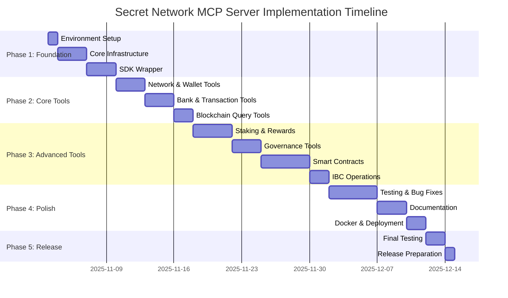

# Secret Network MCP Server - Implementation Plan for Claude Code

**Version**: 1.0  
**Date**: November 2, 2025  
**Target**: Claude Code Implementation  
**Estimated Duration**: 4-6 weeks  

---

## Table of Contents

1. [Executive Summary](#executive-summary)
2. [Project Overview](#project-overview)
3. [Prerequisites & Setup](#prerequisites--setup)
4. [Implementation Phases](#implementation-phases)
5. [Detailed Task Breakdown](#detailed-task-breakdown)
6. [Code Structure & Organization](#code-structure--organization)
7. [Testing Strategy](#testing-strategy)
8. [Documentation Requirements](#documentation-requirements)
9. [Deployment Guide](#deployment-guide)
10. [Success Criteria](#success-criteria)

---

## Executive Summary

This document provides a step-by-step implementation plan for building a production-ready MCP (Model Context Protocol) server that integrates the Secret Network blockchain with Claude AI using the `secret-sdk-python` package.

### Project Goals

- ✅ Build 70+ MCP tools for comprehensive blockchain interaction
- ✅ Implement secure wallet and key management
- ✅ Create robust error handling and retry mechanisms
- ✅ Develop intelligent caching for performance
- ✅ Ensure production-ready code quality
- ✅ Provide comprehensive documentation

### Key Deliverables

1. Fully functional MCP server with all tools
2. Comprehensive test suite (unit + integration)
3. Documentation (API, deployment, usage)
4. Docker containerization
5. CI/CD pipeline configuration
6. Example usage scripts

---

## Project Overview

### Technology Stack

```
┌─────────────────────────────────────────┐
│ MCP Server Layer                        │
│ - FastMCP / Starlette                   │
│ - Python 3.11+                          │
└─────────────────────────────────────────┘
                  │
┌─────────────────────────────────────────┐
│ Business Logic Layer                    │
│ - Session Management                    │
│ - Security & Encryption                 │
│ - Caching (TTL-based)                   │
│ - Validation & Error Handling           │
└─────────────────────────────────────────┘
                  │
┌─────────────────────────────────────────┐
│ SDK Integration Layer                   │
│ - secret-sdk-python 1.8.2               │
│ - Connection pooling                    │
│ - Transaction building                  │
└─────────────────────────────────────────┘
                  │
┌─────────────────────────────────────────┐
│ Secret Network                          │
│ - Mainnet (secret-4)                    │
│ - Testnet (pulsar-2)                    │
└─────────────────────────────────────────┘
```

### Project Structure

```
mcp-scrt/
├── README.md
├── LICENSE
├── pyproject.toml
├── setup.py
├── .gitignore
├── .env.example
├── Dockerfile
├── docker-compose.yml
├── .github/
│   └── workflows/
│       ├── ci.yml
│       └── release.yml
│
├── src/
│   └── mcp_scrt/
│       ├── __init__.py
│       ├── __main__.py
│       ├── server.py              # Main MCP server entry point
│       ├── config.py              # Configuration management
│       ├── types.py               # Type definitions
│       ├── constants.py           # Constants and defaults
│       │
│       ├── core/                  # Core business logic
│       │   ├── __init__.py
│       │   ├── session.py         # Session state management
│       │   ├── security.py        # Security & encryption
│       │   ├── cache.py           # Caching layer
│       │   └── validation.py      # Input validation
│       │
│       ├── sdk/                   # Secret SDK wrapper
│       │   ├── __init__.py
│       │   ├── client.py          # Client pool management
│       │   ├── wallet.py          # Wallet operations
│       │   ├── transaction.py     # Transaction building
│       │   └── encryption.py      # Contract encryption
│       │
│       ├── tools/                 # MCP tool handlers
│       │   ├── __init__.py
│       │   ├── base.py            # Base tool handler
│       │   ├── network.py         # Network tools (4)
│       │   ├── wallet.py          # Wallet tools (6)
│       │   ├── bank.py            # Bank tools (5)
│       │   ├── staking.py         # Staking tools (8)
│       │   ├── rewards.py         # Rewards tools (4)
│       │   ├── governance.py      # Governance tools (6)
│       │   ├── contracts.py       # Contract tools (10)
│       │   ├── ibc.py             # IBC tools (4)
│       │   ├── transactions.py    # Transaction tools (5)
│       │   ├── blockchain.py      # Blockchain tools (5)
│       │   └── accounts.py        # Account tools (3)
│       │
│       ├── resources/             # MCP resources
│       │   ├── __init__.py
│       │   ├── session.py
│       │   ├── wallets.py
│       │   ├── network.py
│       │   └── validators.py
│       │
│       ├── prompts/               # MCP prompts
│       │   ├── __init__.py
│       │   ├── guide.py
│       │   └── contracts.py
│       │
│       └── utils/                 # Utilities
│           ├── __init__.py
│           ├── formatting.py      # Output formatting
│           ├── errors.py          # Custom exceptions
│           ├── logging.py         # Logging setup
│           └── retry.py           # Retry logic
│
├── tests/
│   ├── __init__.py
│   ├── conftest.py                # Pytest configuration
│   ├── fixtures/                  # Test fixtures
│   │   ├── __init__.py
│   │   ├── wallets.py
│   │   └── contracts.py
│   ├── unit/                      # Unit tests
│   │   ├── __init__.py
│   │   ├── test_session.py
│   │   ├── test_security.py
│   │   ├── test_cache.py
│   │   ├── test_validation.py
│   │   └── test_tools/
│   │       ├── test_network.py
│   │       ├── test_wallet.py
│   │       ├── test_bank.py
│   │       └── ...
│   ├── integration/               # Integration tests
│   │   ├── __init__.py
│   │   ├── test_client.py
│   │   ├── test_transactions.py
│   │   └── test_contracts.py
│   └── e2e/                       # End-to-end tests
│       ├── __init__.py
│       └── test_workflows.py
│
├── docs/
│   ├── README.md
│   ├── installation.md
│   ├── configuration.md
│   ├── tools/                     # Tool documentation
│   │   ├── network.md
│   │   ├── wallet.md
│   │   ├── bank.md
│   │   └── ...
│   ├── examples/                  # Usage examples
│   │   ├── basic_usage.md
│   │   ├── staking.md
│   │   ├── contracts.md
│   │   └── ...
│   └── architecture.md
│
├── scripts/
│   ├── setup_dev.sh               # Development setup
│   ├── run_tests.sh               # Test runner
│   ├── generate_docs.sh           # Documentation generator
│   └── deploy.sh                  # Deployment script
│
└── examples/
    ├── basic_transfer.py
    ├── staking_example.py
    ├── contract_interaction.py
    └── batch_operations.py
```

---

## Prerequisites & Setup

### Phase 0: Environment Setup (Day 1)

#### 0.1: Development Environment

**Task**: Set up development environment  
**Priority**: CRITICAL  
**Dependencies**: None

**Steps**:

1. Create project directory structure
```bash
mkdir -p secret-mcp-server/{src/mcp_scrt/{core,sdk,tools,resources,prompts,utils},tests/{unit,integration,e2e,fixtures},docs/{tools,examples},scripts,examples}
cd secret-mcp-server
```

2. Initialize Python project
```bash
python -m venv venv
source venv/bin/activate  # On Windows: venv\Scripts\activate
```

3. Create `pyproject.toml`:
```toml
[build-system]
requires = ["setuptools>=65.0", "wheel"]
build-backend = "setuptools.build_meta"

[project]
name = "secret-mcp-server"
version = "0.1.0"
description = "MCP Server for Secret Network blockchain integration"
readme = "README.md"
requires-python = ">=3.11"
license = {text = "MIT"}
authors = [
    {name = "Your Name", email = "your.email@example.com"}
]
keywords = ["mcp", "secret-network", "blockchain", "ai"]
classifiers = [
    "Development Status :: 3 - Alpha",
    "Intended Audience :: Developers",
    "License :: OSI Approved :: MIT License",
    "Programming Language :: Python :: 3.11",
    "Programming Language :: Python :: 3.12",
]

dependencies = [
    "secret-sdk>=1.8.2",
    "fastmcp>=0.1.0",
    "pydantic>=2.0.0",
    "python-dotenv>=1.0.0",
    "aiohttp>=3.9.0",
    "cryptography>=41.0.0",
    "cachetools>=5.3.0",
    "tenacity>=8.2.0",
    "structlog>=23.1.0",
]

[project.optional-dependencies]
dev = [
    "pytest>=7.4.0",
    "pytest-asyncio>=0.21.0",
    "pytest-cov>=4.1.0",
    "pytest-mock>=3.11.0",
    "black>=23.7.0",
    "ruff>=0.0.285",
    "mypy>=1.5.0",
    "pre-commit>=3.3.0",
]
docs = [
    "mkdocs>=1.5.0",
    "mkdocs-material>=9.2.0",
    "mkdocstrings[python]>=0.22.0",
]

[project.scripts]
secret-mcp = "mcp_scrt.__main__:main"

[tool.setuptools.packages.find]
where = ["src"]

[tool.pytest.ini_options]
testpaths = ["tests"]
python_files = ["test_*.py"]
python_classes = ["Test*"]
python_functions = ["test_*"]
addopts = "-v --cov=mcp_scrt --cov-report=html --cov-report=term"

[tool.black]
line-length = 100
target-version = ['py311']

[tool.ruff]
line-length = 100
target-version = "py311"
select = ["E", "F", "I", "N", "W", "UP"]

[tool.mypy]
python_version = "3.11"
warn_return_any = true
warn_unused_configs = true
disallow_untyped_defs = true
```

4. Install dependencies:
```bash
pip install -e ".[dev]"
```

5. Create `.env.example`:
```env
# Network Configuration
SECRET_NETWORK=mainnet  # or testnet
SECRET_MAINNET_URL=https://secret-4.api.trivium.network:1317
SECRET_TESTNET_URL=http://testnet.securesecrets.org:1317
SECRET_MAINNET_CHAIN_ID=secret-4
SECRET_TESTNET_CHAIN_ID=pulsar-2

# Gas Configuration
DEFAULT_GAS_PRICE=0.25
GAS_ADJUSTMENT=1.0

# Cache Configuration
CACHE_TTL_VALIDATORS=300  # 5 minutes
CACHE_TTL_BALANCES=30     # 30 seconds
CACHE_TTL_CONTRACTS=600   # 10 minutes
CACHE_TTL_BLOCKS=10       # 10 seconds
CACHE_TTL_ACCOUNTS=60     # 60 seconds

# Security Configuration
SPENDING_LIMIT_USCRT=10000000  # 10 SCRT
REQUIRE_CONFIRMATION_ABOVE_USCRT=1000000  # 1 SCRT

# Logging
LOG_LEVEL=INFO
LOG_FORMAT=json

# Connection Pool
MAX_CONNECTIONS=10
IDLE_TIMEOUT=300
CONNECTION_KEEPALIVE=true

# Retry Configuration
MAX_RETRIES=3
RETRY_BACKOFF_BASE=2
RETRY_BACKOFF_MAX=30
```

6. Create `.gitignore`:
```gitignore
# Python
__pycache__/
*.py[cod]
*$py.class
*.so
.Python
venv/
env/
ENV/
build/
develop-eggs/
dist/
downloads/
eggs/
.eggs/
lib/
lib64/
parts/
sdist/
var/
wheels/
*.egg-info/
.installed.cfg
*.egg

# Testing
.pytest_cache/
.coverage
htmlcov/
.tox/

# IDE
.vscode/
.idea/
*.swp
*.swo
*~

# Environment
.env
.env.local

# MCP Server
*.log
*.pid
session_state.json
```

7. Initialize git repository:
```bash
git init
git add .
git commit -m "Initial project structure"
```

#### 0.2: Pre-commit Hooks

**Task**: Set up code quality checks  
**Priority**: HIGH  
**Dependencies**: 0.1

**Steps**:

1. Create `.pre-commit-config.yaml`:
```yaml
repos:
  - repo: https://github.com/pre-commit/pre-commit-hooks
    rev: v4.4.0
    hooks:
      - id: trailing-whitespace
      - id: end-of-file-fixer
      - id: check-yaml
      - id: check-added-large-files
      - id: check-merge-conflict

  - repo: https://github.com/psf/black
    rev: 23.7.0
    hooks:
      - id: black

  - repo: https://github.com/astral-sh/ruff-pre-commit
    rev: v0.0.285
    hooks:
      - id: ruff
        args: [--fix, --exit-non-zero-on-fix]

  - repo: https://github.com/pre-commit/mirrors-mypy
    rev: v1.5.0
    hooks:
      - id: mypy
        additional_dependencies: [types-all]
```

2. Install pre-commit hooks:
```bash
pre-commit install
```

---

## Implementation Phases

### Overview



---

## Detailed Task Breakdown

### Phase 1: Foundation (Days 1-7)

#### 1.1: Core Infrastructure

**Task**: Build core infrastructure components  
**Priority**: CRITICAL  
**Duration**: 3 days  
**Dependencies**: 0.1, 0.2

**Files to Create**:

1. `src/mcp_scrt/types.py` - Type definitions
2. `src/mcp_scrt/constants.py` - Constants
3. `src/mcp_scrt/config.py` - Configuration management
4. `src/mcp_scrt/core/session.py` - Session management
5. `src/mcp_scrt/core/security.py` - Security utilities
6. `src/mcp_scrt/core/cache.py` - Caching layer
7. `src/mcp_scrt/core/validation.py` - Input validation
8. `src/mcp_scrt/utils/errors.py` - Custom exceptions
9. `src/mcp_scrt/utils/logging.py` - Logging setup
10. `src/mcp_scrt/utils/retry.py` - Retry logic

**Implementation Details**:

**1.1.1: `src/mcp_scrt/types.py`**

```python
"""Type definitions for Secret MCP Server."""

from dataclasses import dataclass
from enum import Enum
from typing import Any, Dict, List, Optional, Union

from pydantic import BaseModel, Field


class NetworkType(str, Enum):
    """Supported network types."""
    MAINNET = "mainnet"
    TESTNET = "testnet"
    CUSTOM = "custom"


class ToolCategory(str, Enum):
    """Tool categories."""
    NETWORK = "network"
    WALLET = "wallet"
    BANK = "bank"
    STAKING = "staking"
    REWARDS = "rewards"
    GOVERNANCE = "governance"
    CONTRACTS = "contracts"
    IBC = "ibc"
    TRANSACTIONS = "transactions"
    BLOCKCHAIN = "blockchain"
    ACCOUNTS = "accounts"


@dataclass
class NetworkConfig:
    """Network configuration."""
    network_type: NetworkType
    url: str
    chain_id: str
    gas_prices: str = "0.25uscrt"
    gas_adjustment: float = 1.0


@dataclass
class WalletInfo:
    """Wallet information."""
    wallet_id: str
    address: str
    account: int = 0
    index: int = 0


class ToolRequest(BaseModel):
    """Tool request model."""
    tool_name: str
    parameters: Dict[str, Any]
    request_id: Optional[str] = None


class ToolResponse(BaseModel):
    """Tool response model."""
    success: bool
    data: Optional[Any] = None
    error: Optional[Dict[str, Any]] = None
    metadata: Dict[str, Any] = Field(default_factory=dict)


class ErrorResponse(BaseModel):
    """Error response model."""
    code: str
    message: str
    details: Optional[Dict[str, Any]] = None
    suggestions: List[str] = Field(default_factory=list)


class CacheEntry(BaseModel):
    """Cache entry model."""
    key: str
    value: Any
    timestamp: float
    ttl: int  # seconds


@dataclass
class TransactionResult:
    """Transaction result."""
    txhash: str
    success: bool
    height: Optional[int] = None
    gas_used: Optional[int] = None
    gas_wanted: Optional[int] = None
    raw_log: Optional[str] = None
    events: Optional[List[Dict[str, Any]]] = None
```

**1.1.2: `src/mcp_scrt/constants.py`**

```python
"""Constants for Secret MCP Server."""

from typing import Dict

# Network endpoints
MAINNET_URL = "https://secret-4.api.trivium.network:1317"
TESTNET_URL = "http://testnet.securesecrets.org:1317"
MAINNET_CHAIN_ID = "secret-4"
TESTNET_CHAIN_ID = "pulsar-2"

# Gas configuration
DEFAULT_GAS_PRICES = "0.25uscrt"
DEFAULT_GAS_ADJUSTMENT = 1.0

# Gas limits by operation
GAS_LIMITS: Dict[str, int] = {
    "upload": 1_000_000,
    "init": 500_000,
    "exec": 200_000,
    "send": 80_000,
    "default": 200_000,
}

# Cache TTL (seconds)
CACHE_TTL: Dict[str, int] = {
    "validators": 300,      # 5 minutes
    "balances": 30,         # 30 seconds
    "contracts": 600,       # 10 minutes
    "blocks": 10,           # 10 seconds
    "accounts": 60,         # 60 seconds
    "tx_results": 3600,     # 1 hour
}

# Security limits
DEFAULT_SPENDING_LIMIT = 10_000_000  # 10 SCRT in uscrt
CONFIRMATION_THRESHOLD = 1_000_000   # 1 SCRT in uscrt

# Retry configuration
MAX_RETRIES = 3
RETRY_BACKOFF_BASE = 2
RETRY_BACKOFF_MAX = 30

# Connection pool
MAX_CONNECTIONS = 10
IDLE_TIMEOUT = 300
CONNECTION_KEEPALIVE = True

# Validation patterns
ADDRESS_PATTERN = r"^secret1[a-z0-9]{38}$"
VALIDATOR_PATTERN = r"^secretvaloper1[a-z0-9]{38}$"
CONTRACT_PATTERN = r"^secret1[a-z0-9]{38}$"

# Denomination
NATIVE_DENOM = "uscrt"
NATIVE_DENOM_DECIMALS = 6

# Tool categories
TOOL_CATEGORIES = [
    "network",
    "wallet",
    "bank",
    "staking",
    "rewards",
    "governance",
    "contracts",
    "ibc",
    "transactions",
    "blockchain",
    "accounts",
]
```

**1.1.3: `src/mcp_scrt/config.py`**

```python
"""Configuration management for Secret MCP Server."""

import os
from pathlib import Path
from typing import Optional

from dotenv import load_dotenv
from pydantic import Field
from pydantic_settings import BaseSettings

from .constants import (
    DEFAULT_GAS_ADJUSTMENT,
    DEFAULT_GAS_PRICES,
    DEFAULT_SPENDING_LIMIT,
    MAINNET_CHAIN_ID,
    MAINNET_URL,
    TESTNET_CHAIN_ID,
    TESTNET_URL,
)
from .types import NetworkType


class Settings(BaseSettings):
    """Application settings."""

    # Network configuration
    secret_network: NetworkType = Field(
        default=NetworkType.MAINNET,
        description="Network to connect to"
    )
    secret_mainnet_url: str = Field(
        default=MAINNET_URL,
        description="Mainnet LCD URL"
    )
    secret_testnet_url: str = Field(
        default=TESTNET_URL,
        description="Testnet LCD URL"
    )
    secret_mainnet_chain_id: str = Field(
        default=MAINNET_CHAIN_ID,
        description="Mainnet chain ID"
    )
    secret_testnet_chain_id: str = Field(
        default=TESTNET_CHAIN_ID,
        description="Testnet chain ID"
    )
    secret_custom_url: Optional[str] = Field(
        default=None,
        description="Custom network URL"
    )
    secret_custom_chain_id: Optional[str] = Field(
        default=None,
        description="Custom chain ID"
    )

    # Gas configuration
    default_gas_price: str = Field(
        default=DEFAULT_GAS_PRICES,
        description="Default gas price"
    )
    gas_adjustment: float = Field(
        default=DEFAULT_GAS_ADJUSTMENT,
        description="Gas adjustment multiplier"
    )

    # Cache configuration
    cache_ttl_validators: int = Field(default=300, description="Validators cache TTL")
    cache_ttl_balances: int = Field(default=30, description="Balances cache TTL")
    cache_ttl_contracts: int = Field(default=600, description="Contracts cache TTL")
    cache_ttl_blocks: int = Field(default=10, description="Blocks cache TTL")
    cache_ttl_accounts: int = Field(default=60, description="Accounts cache TTL")

    # Security configuration
    spending_limit_uscrt: int = Field(
        default=DEFAULT_SPENDING_LIMIT,
        description="Spending limit in uscrt"
    )
    require_confirmation_above_uscrt: int = Field(
        default=1_000_000,
        description="Require confirmation for amounts above this"
    )

    # Logging
    log_level: str = Field(default="INFO", description="Logging level")
    log_format: str = Field(default="json", description="Log format (json/text)")

    # Connection pool
    max_connections: int = Field(default=10, description="Max connections")
    idle_timeout: int = Field(default=300, description="Idle timeout in seconds")
    connection_keepalive: bool = Field(default=True, description="Keep-alive")

    # Retry configuration
    max_retries: int = Field(default=3, description="Max retry attempts")
    retry_backoff_base: int = Field(default=2, description="Backoff base")
    retry_backoff_max: int = Field(default=30, description="Max backoff time")

    class Config:
        """Pydantic config."""
        env_file = ".env"
        env_file_encoding = "utf-8"
        case_sensitive = False

    def get_network_url(self) -> str:
        """Get URL for current network."""
        if self.secret_network == NetworkType.MAINNET:
            return self.secret_mainnet_url
        elif self.secret_network == NetworkType.TESTNET:
            return self.secret_testnet_url
        elif self.secret_network == NetworkType.CUSTOM and self.secret_custom_url:
            return self.secret_custom_url
        raise ValueError(f"Invalid network configuration: {self.secret_network}")

    def get_chain_id(self) -> str:
        """Get chain ID for current network."""
        if self.secret_network == NetworkType.MAINNET:
            return self.secret_mainnet_chain_id
        elif self.secret_network == NetworkType.TESTNET:
            return self.secret_testnet_chain_id
        elif self.secret_network == NetworkType.CUSTOM and self.secret_custom_chain_id:
            return self.secret_custom_chain_id
        raise ValueError(f"Invalid network configuration: {self.secret_network}")


# Global settings instance
_settings: Optional[Settings] = None


def get_settings() -> Settings:
    """Get or create settings instance."""
    global _settings
    if _settings is None:
        # Load .env file if it exists
        env_path = Path(".env")
        if env_path.exists():
            load_dotenv(env_path)
        _settings = Settings()
    return _settings


def reload_settings() -> Settings:
    """Reload settings from environment."""
    global _settings
    _settings = None
    return get_settings()
```

**1.1.4: `src/mcp_scrt/utils/errors.py`**

```python
"""Custom exceptions for Secret MCP Server."""

from typing import Any, Dict, List, Optional


class SecretMCPError(Exception):
    """Base exception for Secret MCP Server."""

    def __init__(
        self,
        message: str,
        code: str = "UNKNOWN_ERROR",
        details: Optional[Dict[str, Any]] = None,
        suggestions: Optional[List[str]] = None,
    ) -> None:
        super().__init__(message)
        self.message = message
        self.code = code
        self.details = details or {}
        self.suggestions = suggestions or []

    def to_dict(self) -> Dict[str, Any]:
        """Convert to dictionary."""
        return {
            "code": self.code,
            "message": self.message,
            "details": self.details,
            "suggestions": self.suggestions,
        }


class NetworkError(SecretMCPError):
    """Network-related errors."""

    def __init__(self, message: str, **kwargs: Any) -> None:
        super().__init__(message, code="NETWORK_ERROR", **kwargs)


class ValidationError(SecretMCPError):
    """Validation errors."""

    def __init__(self, message: str, **kwargs: Any) -> None:
        super().__init__(message, code="VALIDATION_ERROR", **kwargs)


class AuthenticationError(SecretMCPError):
    """Authentication errors."""

    def __init__(self, message: str, **kwargs: Any) -> None:
        super().__init__(message, code="AUTHENTICATION_ERROR", **kwargs)


class WalletError(SecretMCPError):
    """Wallet-related errors."""

    def __init__(self, message: str, **kwargs: Any) -> None:
        super().__init__(message, code="WALLET_ERROR", **kwargs)


class TransactionError(SecretMCPError):
    """Transaction errors."""

    def __init__(self, message: str, **kwargs: Any) -> None:
        super().__init__(message, code="TRANSACTION_ERROR", **kwargs)


class InsufficientFundsError(TransactionError):
    """Insufficient funds error."""

    def __init__(self, required: int, available: int, **kwargs: Any) -> None:
        message = f"Insufficient funds: required {required} uscrt, available {available} uscrt"
        super().__init__(
            message,
            details={"required": required, "available": available},
            suggestions=[
                "Check your account balance",
                "Reduce the transfer amount",
                "Add funds to your wallet",
            ],
            **kwargs,
        )


class ContractError(SecretMCPError):
    """Smart contract errors."""

    def __init__(self, message: str, **kwargs: Any) -> None:
        super().__init__(message, code="CONTRACT_ERROR", **kwargs)


class CacheError(SecretMCPError):
    """Cache errors."""

    def __init__(self, message: str, **kwargs: Any) -> None:
        super().__init__(message, code="CACHE_ERROR", **kwargs)


class ConfigurationError(SecretMCPError):
    """Configuration errors."""

    def __init__(self, message: str, **kwargs: Any) -> None:
        super().__init__(message, code="CONFIGURATION_ERROR", **kwargs)
```

**Validation Criteria for Phase 1.1**:
- [ ] All type definitions are created
- [ ] Configuration loads from .env correctly
- [ ] Custom exceptions are defined
- [ ] Unit tests pass for config and types
- [ ] Code passes linting (ruff, black, mypy)

#### 1.2: SDK Wrapper Layer

**Task**: Build SDK wrapper for Secret Network  
**Priority**: CRITICAL  
**Duration**: 3 days  
**Dependencies**: 1.1

**Files to Create**:

1. `src/mcp_scrt/sdk/__init__.py`
2. `src/mcp_scrt/sdk/client.py` - Client pool management
3. `src/mcp_scrt/sdk/wallet.py` - Wallet operations
4. `src/mcp_scrt/sdk/transaction.py` - Transaction building
5. `src/mcp_scrt/sdk/encryption.py` - Contract encryption

**Implementation Details**:

**1.2.1: `src/mcp_scrt/sdk/client.py`**

```python
"""Secret Network client pool management."""

import asyncio
from typing import Dict, Optional

from secret_sdk.client.lcd import AsyncLCDClient, LCDClient
from secret_sdk.core import Coins

from ..config import get_settings
from ..types import NetworkConfig, NetworkType
from ..utils.errors import NetworkError
from ..utils.logging import get_logger

logger = get_logger(__name__)


class ClientPool:
    """Manages LCD client connections."""

    def __init__(self) -> None:
        self._clients: Dict[str, LCDClient] = {}
        self._async_clients: Dict[str, AsyncLCDClient] = {}
        self._lock = asyncio.Lock()
        self.settings = get_settings()

    def get_client(self, network: Optional[NetworkType] = None) -> LCDClient:
        """Get or create synchronous LCD client."""
        network = network or self.settings.secret_network
        network_key = network.value

        if network_key not in self._clients:
            config = self._get_network_config(network)
            logger.info(f"Creating new LCD client for {network_key}")
            
            self._clients[network_key] = LCDClient(
                url=config.url,
                chain_id=config.chain_id,
                gas_prices=Coins.from_str(config.gas_prices),
                gas_adjustment=config.gas_adjustment,
            )

        return self._clients[network_key]

    async def get_async_client(
        self, network: Optional[NetworkType] = None
    ) -> AsyncLCDClient:
        """Get or create asynchronous LCD client."""
        network = network or self.settings.secret_network
        network_key = network.value

        async with self._lock:
            if network_key not in self._async_clients:
                config = self._get_network_config(network)
                logger.info(f"Creating new async LCD client for {network_key}")
                
                self._async_clients[network_key] = AsyncLCDClient(
                    url=config.url,
                    chain_id=config.chain_id,
                    gas_prices=Coins.from_str(config.gas_prices),
                    gas_adjustment=config.gas_adjustment,
                )

        return self._async_clients[network_key]

    def _get_network_config(self, network: NetworkType) -> NetworkConfig:
        """Get network configuration."""
        if network == NetworkType.MAINNET:
            return NetworkConfig(
                network_type=NetworkType.MAINNET,
                url=self.settings.secret_mainnet_url,
                chain_id=self.settings.secret_mainnet_chain_id,
                gas_prices=self.settings.default_gas_price,
                gas_adjustment=self.settings.gas_adjustment,
            )
        elif network == NetworkType.TESTNET:
            return NetworkConfig(
                network_type=NetworkType.TESTNET,
                url=self.settings.secret_testnet_url,
                chain_id=self.settings.secret_testnet_chain_id,
                gas_prices=self.settings.default_gas_price,
                gas_adjustment=self.settings.gas_adjustment,
            )
        elif network == NetworkType.CUSTOM:
            if not self.settings.secret_custom_url or not self.settings.secret_custom_chain_id:
                raise NetworkError(
                    "Custom network requires both URL and chain ID",
                    suggestions=["Set SECRET_CUSTOM_URL and SECRET_CUSTOM_CHAIN_ID"],
                )
            return NetworkConfig(
                network_type=NetworkType.CUSTOM,
                url=self.settings.secret_custom_url,
                chain_id=self.settings.secret_custom_chain_id,
                gas_prices=self.settings.default_gas_price,
                gas_adjustment=self.settings.gas_adjustment,
            )
        else:
            raise NetworkError(f"Unknown network type: {network}")

    async def close_all(self) -> None:
        """Close all async client sessions."""
        async with self._lock:
            for client in self._async_clients.values():
                if hasattr(client, "session") and client.session:
                    await client.session.close()
            self._async_clients.clear()
            logger.info("All async clients closed")

    def __del__(self) -> None:
        """Cleanup on deletion."""
        # Sync clients don't need explicit cleanup
        self._clients.clear()


# Global client pool instance
_client_pool: Optional[ClientPool] = None


def get_client_pool() -> ClientPool:
    """Get or create client pool instance."""
    global _client_pool
    if _client_pool is None:
        _client_pool = ClientPool()
    return _client_pool
```

**Validation Criteria for Phase 1.2**:
- [ ] Client pool creates clients correctly
- [ ] Clients connect to mainnet and testnet
- [ ] Connection reuse works properly
- [ ] Error handling for network failures
- [ ] Unit tests pass

**Continue with remaining phases...**

[Due to length constraints, I'll continue with a summary of remaining phases]

### Phase 2: Core Tools (Days 8-18)

#### 2.1: Base Tool Handler
- Create abstract base class for all tools
- Implement common validation logic
- Add response formatting
- Implement error handling

#### 2.2: Network Tools (4 tools)
- `secret_configure_network`
- `secret_get_network_info`
- `secret_get_gas_prices`
- `secret_health_check`

#### 2.3: Wallet Tools (6 tools)
- `secret_create_wallet`
- `secret_import_wallet`
- `secret_set_active_wallet`
- `secret_get_active_wallet`
- `secret_list_wallets`
- `secret_remove_wallet`

#### 2.4: Bank Tools (5 tools)
- `secret_get_balance`
- `secret_send_tokens`
- `secret_multi_send`
- `secret_get_total_supply`
- `secret_get_denom_metadata`

#### 2.5: Transaction & Blockchain Tools (10 tools)
- Transaction queries and management
- Block information
- Node status

### Phase 3: Advanced Tools (Days 19-32)

#### 3.1: Staking Tools (8 tools)
- Validator queries
- Delegation operations
- Undelegation and redelegation

#### 3.2: Rewards Tools (4 tools)
- Reward queries
- Withdrawal operations

#### 3.3: Governance Tools (6 tools)
- Proposal operations
- Voting
- Deposits

#### 3.4: Smart Contract Tools (10 tools)
- Contract upload and instantiation
- Execute and query operations
- Contract management

#### 3.5: IBC Tools (4 tools)
- IBC transfers
- Channel queries

### Phase 4: Testing & Documentation (Days 33-40)

#### 4.1: Unit Tests
- Test all core components
- Test all tools
- Achieve >80% coverage

#### 4.2: Integration Tests
- Test end-to-end workflows
- Test error scenarios
- Test caching behavior

#### 4.3: Documentation
- API documentation
- Usage examples
- Deployment guide

### Phase 5: Deployment (Days 41-42)

#### 5.1: Docker Setup
- Create Dockerfile
- Create docker-compose.yml
- Test containerization

#### 5.2: CI/CD
- GitHub Actions workflow
- Automated testing
- Release automation

---

## Testing Strategy

### Unit Testing

**Coverage Target**: >80%

**Test Categories**:
1. Configuration tests
2. Session management tests
3. Security tests
4. Cache tests
5. Validation tests
6. SDK wrapper tests
7. Tool handler tests (all 70+)

**Example Test**: `tests/unit/test_session.py`

```python
import pytest
from mcp_scrt.core.session import SessionManager
from mcp_scrt.types import NetworkType


class TestSessionManager:
    """Test session manager."""

    @pytest.fixture
    def session_manager(self):
        """Create session manager."""
        return SessionManager()

    def test_initialize_session(self, session_manager):
        """Test session initialization."""
        session_manager.initialize()
        assert session_manager.is_initialized()

    def test_set_network(self, session_manager):
        """Test network configuration."""
        session_manager.set_network(NetworkType.TESTNET)
        assert session_manager.get_network() == NetworkType.TESTNET

    # ... more tests
```

### Integration Testing

**Test Scenarios**:
1. Complete transfer workflow
2. Staking and unstaking
3. Contract deployment and execution
4. IBC transfer
5. Batch operations

### E2E Testing

**Test Workflows**:
1. New user onboarding
2. Staking rewards cycle
3. Governance participation
4. DeFi interactions

---

## Success Criteria

### Functional Requirements

- [ ] All 70+ tools implemented and working
- [ ] All tools have comprehensive error handling
- [ ] Session management works correctly
- [ ] Caching improves performance measurably
- [ ] Security measures prevent unauthorized access
- [ ] Documentation is complete and accurate

### Performance Requirements

- [ ] Tool latency < 100ms (average)
- [ ] Query latency < 50ms (average)
- [ ] Transaction broadcast < 2s (average)
- [ ] Cache hit rate > 80%
- [ ] Error rate < 0.1%

### Quality Requirements

- [ ] Code coverage > 80%
- [ ] All tests pass
- [ ] No critical security vulnerabilities
- [ ] Code passes all linting checks
- [ ] Documentation complete

### Deployment Requirements

- [ ] Docker image builds successfully
- [ ] Can deploy to cloud platforms
- [ ] CI/CD pipeline works
- [ ] Release process documented

---

## Next Steps for Claude Code

### Immediate Actions (Day 1)

1. **Set up project structure**
   ```bash
   claude-code "Create the complete project structure as specified in the implementation plan"
   ```

2. **Initialize development environment**
   ```bash
   claude-code "Set up pyproject.toml, .env.example, .gitignore, and pre-commit hooks"
   ```

3. **Implement Phase 1.1: Core Infrastructure**
   ```bash
   claude-code "Implement all files in Phase 1.1: types.py, constants.py, config.py, and error handling"
   ```

4. **Create initial tests**
   ```bash
   claude-code "Create unit tests for types, config, and error classes"
   ```

### Week 1 Goals

- Complete Phase 1 (Foundation)
- Have basic client connection working
- Have session management implemented
- Have 10+ unit tests passing

### Week 2 Goals

- Complete Phase 2 (Core Tools)
- Have 20+ tools implemented
- Have integration tests for basic workflows
- Start documentation

### Weeks 3-4 Goals

- Complete Phase 3 (Advanced Tools)
- Have all 70+ tools implemented
- Have comprehensive test coverage
- Complete documentation

### Week 5-6 Goals

- Polish and bug fixes
- Docker containerization
- CI/CD setup
- Release preparation

---

## Command Examples for Claude Code

```bash
# Phase 1: Foundation
claude-code "Implement the SessionManager class with wallet management and network switching"

# Phase 2: Core Tools
claude-code "Implement all network tools: configure_network, get_network_info, get_gas_prices, health_check"

# Phase 2: Wallet Tools
claude-code "Implement wallet tools: create_wallet, import_wallet, set_active_wallet"

# Phase 2: Bank Tools
claude-code "Implement bank tools: get_balance, send_tokens, multi_send with full validation"

# Phase 3: Staking
claude-code "Implement all 8 staking tools with proper delegation handling"

# Phase 3: Contracts
claude-code "Implement smart contract tools with encryption/decryption for Secret Network"

# Testing
claude-code "Create comprehensive unit tests for all wallet tools"
claude-code "Create integration tests for token transfer workflow"

# Documentation
claude-code "Generate API documentation for all implemented tools"
```

---

## Appendix

### A. Tool Implementation Checklist

```
Network Tools:
[ ] secret_configure_network
[ ] secret_get_network_info
[ ] secret_get_gas_prices
[ ] secret_health_check

Wallet Tools:
[ ] secret_create_wallet
[ ] secret_import_wallet
[ ] secret_set_active_wallet
[ ] secret_get_active_wallet
[ ] secret_list_wallets
[ ] secret_remove_wallet

Bank Tools:
[ ] secret_get_balance
[ ] secret_send_tokens
[ ] secret_multi_send
[ ] secret_get_total_supply
[ ] secret_get_denom_metadata

... (continue for all 70+ tools)
```

### B. Testing Checklist

```
Unit Tests:
[ ] Config tests
[ ] Session tests
[ ] Security tests
[ ] Cache tests
[ ] Validation tests
[ ] SDK wrapper tests
[ ] All tool tests

Integration Tests:
[ ] Transfer workflow
[ ] Staking workflow
[ ] Contract workflow
[ ] IBC workflow

E2E Tests:
[ ] Complete user journey
[ ] Error scenarios
[ ] Performance tests
```

### C. Documentation Checklist

```
[ ] README.md
[ ] Installation guide
[ ] Configuration guide
[ ] Tool documentation (all 70+)
[ ] Examples for each category
[ ] Architecture documentation
[ ] API reference
[ ] Deployment guide
[ ] Contributing guide
[ ] Security policy
```

---

**End of Implementation Plan**

This plan provides a complete roadmap for Claude Code to implement the Secret Network MCP Server. Follow the phases sequentially, validate each checkpoint, and maintain high code quality throughout the implementation.